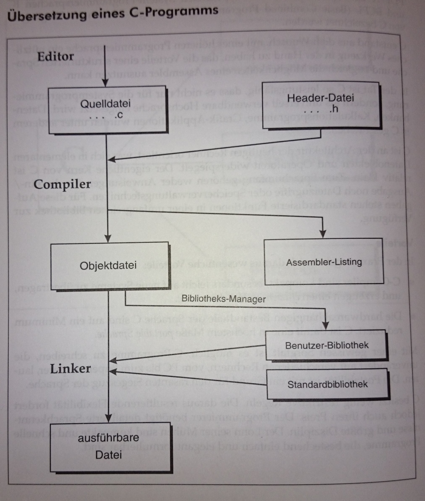

# 1.1. C-Grundlagen

## Grundsätzlich
* Kompakte, strukturierte, typisierte, hardwarenahe, portable, höhere Programmiersprache
* Ein-/Ausgabe ist nicht im Befehlsumfang enthalten -> Funktionen der Standardbibliothek
* Ein Zeiger repräsentiert eine Adresse und nicht wie eine Variable einen Wert. Will man auf den Wert der Adresse zugreifen, auf die ein Zeiger zeigt, muss * vor den Namen gesetzt werden.
* (Software)Bibliotheken werden mit #include <...> hinzugefügt

```c
int zahl = 7;
int *zeiger;
zeiger = &zahl;
printf("Zeiger-Wert: %d\n", *zeiger);
```

## Quellcode-Übersetzen-Syntax-Semantik
* C-Quellcode muss Grammatik (Syntax) & fachliche Anforderung (Semantik) erfüllen
* Semikolon am Ende & Kommentare wie in Java
* Geschriebener Quellcode wird vom Compiler in Objektcode übersetzt und danach vom Linker mit Bibliotheken zu einem ausführbaren Programm gebunden
* Der Compiler ruft vor der eigentlichen Übersetzung den Präprozessor auf, der die Präprozessordirektive (Ganz oben #define, #include, usw.) auswertet



## H&C-File
* C-Quellcode setzt sich  aus Quellcode-Dateien (`.c`) zusammen, die Header-Dateien mittels `#include` einbinden (`.h`);
*  `.c`-File: SourceCode
*  `.h`-File: Funktionsdeklarationen/Prototypen, Konstanten, usw., die in mehreren `.c`-Files verwendet werden

## Primitive Datentypen (Datentyplänge, Unsigned/Signed)

| Type                   | Size (bytes)                  | Format Specifier |
|------------------------|-------------------------------|------------------|
| int                    | at least 2, usually 4         | %d, %i           |
| char                   | 1                             | %c               |
| float                  | 4                             | %f               |
| double                 | 8                             | %lf              |
| short int              | 2 usually                     | %hd              |
| unsigned int           | at least 2, usually 4         | %u               |
| long int               | at least 4, usually 8         | %ld, %li         |
| long long int          | at least 8                    | %lld, %lli       |
| unsigned long int      | at least 4                    | %lu              |
| unsigned long long int | at least 8                    | %llu             |
| signed char            | 1                             | %c               |
| unsigned char          | 1                             | %c               |
| long double            | at least 10, usually 12 or 16 | %Lf              |

* Mit `sizeof(variable)` erhält man die Größe eines Datentyps in Byte
* char ≤ short int ≤ int ≤ long int ≤ long long int
* float, double & long double sind immer signed
* signed: positiv & negativ -> Wertebereich 50% pos, 50% neg
    * Bsp: signed char von -127 bis 127
* unsigned: nur positiv -> Wertebereich 100% pos
    * Bsp: unsigned char von 0 bis 256

## Variablen-, Konstanten & Funktionen
* Buchstaben (ausgenommen Umlaute, ß), Ziffern und Unterstrich
* Mit Buchstaben beginnen
* Konstanten mit `#define NAME Wert`

## Ein-/Ausgabe
* Erfordert `#include <stdio.h>`
* Formatierung mit `sprintf(array, "Format", variablen...)`
* Ausgabe mit `printf("Text");` oder `printf("%d",&number);`
* Einlesen mit `scanf("%d",&number);`
* Zeichenkette einlesen mit `fgets(array, laenge, stdin/File)`

## Prototypen
* Deklaration einer Funktion – inklusive Angaben über Anzahl, Typ der Parameter und Typ des Rückgabewertes – getrennt von ihrer Implementierung

```c
// enthält unter anderem den Funktionsprototypen für printf():
#include <stdio.h>

// Prototypdeklaration, die Parameterbezeichner sind optional:
double summe(double zahl1, double zahl2);

int main(void) {
    // Aufruf der Funktion; ohne Funktionsprototyp wären hier
    // Argumenttyp (int) und Parametertyp (double) inkompatibel:
    printf("2 + 3 = %g\n", summe(2, 3));
    return 0;
}

// Definition der Funktion:
double summe(double zahl1, double zahl2) {
    return zahl1 + zahl2;
}
```

## Zeiger

### Grundsätzliches

* Adresse + Typ eines Objekts
* Zeiger referenziert (zeigt auf) Adresse
* Objekttyp gibt Größe der Speicherzelle an 
* Deklaration: Datentyp *name;
* z.B.:
	* int *p (Datentyp ist hier int *, also die Adresses eines int Wertes)
	* &p liefert Adressse von p
* Bsp.:

```c
int *ptr; // Zeiger auf int
int value = 123; // eine int-Variable
ptr = &value; // der Zeiger ptr zeigt auf value
```

### Call-by-Reference
* Normalerweise wird in C eine Kopie der Variable übergeben
* Änderungen von der Variable haben keine Auswirkung außerhalb der Funktion
* Wird aber ein Zeiger auf die Variable übergeben, so ändert sich die Variablen
*Bsp.:

```c
int main (){
	int x = 2;
	int y = 3;
	swap (&x, &y);
}

void swap (int *i1, int *i2){
	int help;
	help = *i1;
	*i1 = *i2;
	*i2 = help;
}
```

### NULL-Zeiger
* Um Segmentation fault zu vermeiden Zeiger mit NULL initialisieren
* int *iptr = NULL

### Zeiger und Arrays
* int a[4] = {10, 20, 30, 40};
* a zeigt auf 1. Array Element a[0]

```c
int *pa;
pa = a;
```

* pa zeigt auf a[0]
* pa+1 und a zeigen auf a[1]
* Bsp.:

```c
int main () {
	int a[4] = {10, 20, 30, 40};
	int *pa;
	pa = a;
	for (i = 0; i<4; i++)
		printf („Adresse: %p, Wert: %2d\n“,
			pa+i, *(pa+i));
	return 0;
}
```

## Structs
* Bsp.:

```c
struct Books {
   char  title[50];
   char  author[50];
   char  subject[100];
   int   book_id;
};

int main( ) {

   struct Books Book1;        /* Declare Book1 of type Book */
   struct Books Book2;        /* Declare Book2 of type Book */
 
   /* book 1 specification */
   strcpy( Book1.title, "C Programming");
   strcpy( Book1.author, "Nuha Ali"); 
   strcpy( Book1.subject, "C Programming Tutorial");
   Book1.book_id = 6495407;

   /* book 2 specification */
   strcpy( Book2.title, "Telecom Billing");
   strcpy( Book2.author, "Zara Ali");
   strcpy( Book2.subject, "Telecom Billing Tutorial");
   Book2.book_id = 6495700;
 
   /* print Book1 info */
   printf( "Book 1 title : %s\n", Book1.title);
   printf( "Book 1 author : %s\n", Book1.author);
   printf( "Book 1 subject : %s\n", Book1.subject);
   printf( "Book 1 book_id : %d\n", Book1.book_id);

   /* print Book2 info */
   printf( "Book 2 title : %s\n", Book2.title);
   printf( "Book 2 author : %s\n", Book2.author);
   printf( "Book 2 subject : %s\n", Book2.subject);
   printf( "Book 2 book_id : %d\n", Book2.book_id);

   return 0;
}
```

### typdef struct
* Bei Verwendung von typdef kann bei der Deklarierung das Schlüsselwort "struct" weggelassen werden
* Bsp.:

```c
#include <stdio.h>
#include <string.h>

//normal structure declaration
struct student_str {
	char name[30];
	int age;
};

//structur declaration with typedef
typedef struct {
	char name[30];
	int age;
}employee_str;

//main code
int main()
{
    
	//declare structure variable for student_str
	struct student_str std;
	//declare structure variable for employee_str
	employee_str emp;
	
	//assign values to std 
	strcpy(std.name, "Amit Shukla");
	std.age = 21;
	
	//assign values to emp
	strcpy(emp.name, "Abhishek Jain");
	emp.age = 27;
	
	//print std and emp structure 
	printf("Student detail:\n");
	printf("Name: %s\n",std.name);
	printf("Age: %d\n",std.age);
	
	printf("Employee detail:\n");
	printf("Name: %s\n",emp.name);
	printf("Age: %d\n",emp.age);	
	
	return 0;
}
```
