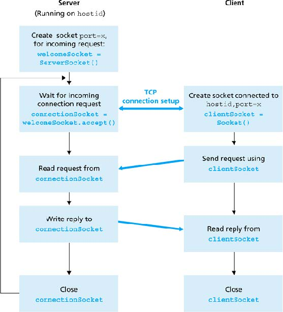

# 3.1. Sockets

## Allgemein
* Bei Client/Server immer ein Protokoll verwenden, wenn keines vorgegeben ist, dann selbst erfinden
* Um Objekte mit Streams zu Senden/Empfangen/Speichern/usw. müssen diese das Interface Serializable implementieren
  - Ebenso sollte diesen Klassen ein `SerialVersionUID`-Attribut mit einer uniquen ID gegeben werden

## Properties
* Wichtige Daten, die ggf. für jeden Benutzer unterschiedlich sind, sollten in Properties gespeichert werden
  - z.B.: IP-Adresse, Port, User, Passwort, usw.
* Diese Properties müssen dann mittels einem FileInputStream eingelesen und mit dem Key kann dann auf die Attribute zugegriffen werden.
* Grundgerüst:

```java
String propertiesFile, url, port;

try (BufferedInputStream bis = new BufferedInputStream(new FileInputStream(propertiesFile))) {
  Properties properties = new Properties();
  properties.load(bis);
  url = properties.getProperty("url");
  port = properties.getProperty("port");
}
```

## ServerSocket
* Klasse: `java.net.ServerSocket`
* Socket, der auf bestimmten Port gebunden ist
* Wartet auf eingehende Verbindungen
* Alles ok -> Verbindung wird akzeptiert
* Server bekommt neuen Socket für die akzeptierte Verbindung
* „Ursprünglicher“ Socket lauscht weiter auf eingehende Verbindungen

## ClientSocket
* Klasse: `java.net.Socket`
* Socket erstellen - Verbindungsaufbau zu Server
* Wird Verbindung akzeptiert, so kann der Client über diesen Socket mit Server kommunizieren
* Client- sowie Server-Socket können jeweils am Socket lesen/schreiben

## Ablauf


## Beispiel EchoServer (Bereits mit Multithreading am Server)
* [Echoserver](https://github.com/htlw-5ahit/matura-sew-insy/tree/main/thema03/echoserver)
