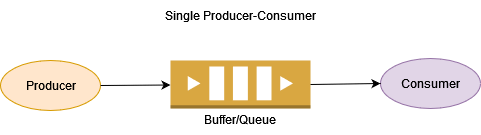

# 3.2. Socket mit Threads

## Socket bei JavaFX (Task/Service)
* Kommunikation muss nebenläufig erfolgen -> Task/ExecuterService
* Socket sollte einmalig beim Start erstellt werden
* Socket/Streams an Task übergeben
* Bei Close-Command oder bei Beendigung des Programms müssen Sockets und Streams geschlossen werden

## Executer & ExecuterService
* Schnittstelle, die es ermöglicht, Aufgaben auf Threads asynchron auszuführen
* Hilft bei der Verwaltung eines Pools von Threads und weist ihnen Aufgaben zu
* Möglichkeit, Aufgaben in eine Warteschlange zu stellen, bis ein freier Thread verfügbar ist, wenn die Anzahl der Aufgaben die Anzahl der verfügbaren Threads übersteigt
* ThreadPools
  - `Executors.newFixedThreadPool(size);`
    - Wenn die Max-Anzahl erreicht wurde, wird gewartet, bis wieder ein Thread frei wird.
  - `Executors.newCachedThreadPool();`
    - Erstellt beliebig viele Threads, wenn ein Thread 60s inaktiv ist, wird dieser wieder freigegeben.
  - `Executors.newSingleThreadExecutor();`
    - Es wird nur 1 Thread erstellt
  - `Executors.newScheduledThreadPool();`
    - Die Startzeit kann festgelegt werden

## Consumer/Producer
* Producer und Consumer sind zwei getrennte Prozesse. Beide Prozesse teilen sich einen gemeinsamen Puffer oder eine Warteschlange.
* Der Producer produziert kontinuierlich bestimmte Daten und schiebt sie in den Puffer, während der Consumer diese Daten aus dem Puffer konsumiert.

Schauen wir uns ein Diagramm an, das dieses einfache Szenario zeigt:

Dieses Problem ist von vornherein mit gewissen Komplexitäten verbunden:
* Sowohl der Produzent als auch der Konsument können versuchen, die Warteschlange gleichzeitig zu aktualisieren. Dies könnte zu Datenverlusten oder Inkonsistenzen führen.
* Die Produzenten könnten langsamer sein als die Konsumenten. In solchen Fällen würde der Verbraucher Elemente schnell verarbeiten und warten.
* In manchen Fällen kann der Konsument langsamer sein als ein Produzent. In diesem Fall kommt es zu einem Überlauf der Warteschlange.
* In realen Szenarien können wir mehrere Produzenten, mehrere Konsumenten oder beides haben. Dies kann dazu führen, dass ein und dieselbe Nachricht von verschiedenen Verbrauchern verarbeitet wird.

* Schulbeispiel: [https://github.com/htlw-5ahit/matura-sew-insy/tree/main/thema03/producerconsumer](https://github.com/htlw-5ahit/matura-sew-insy/tree/main/thema03/producerconsumer)

## Beispiel CalculatorServer (mit JavaFX am Client && Multithreading am Server)
* [https://github.com/htlw-5ahit/matura-sew-insy/tree/main/thema03/calculatorserver](https://github.com/htlw-5ahit/matura-sew-insy/tree/main/thema03/calculatorserver)
