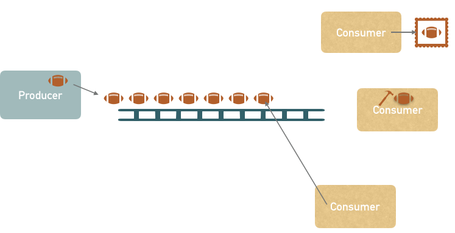

# 4106_ProducerConsumer



## Producer
- Produzent produziert Bälle (simuliert durch Zufallszahlen)
- die Produktion eines Balls dauert eine zufällige Zeit (z.B. zw. 500 und 1000ms)
- die produzierten Bälle werden gedanklich auf ein Fließband gelegt (Speicherung in Queue)
- das Fließband ist auf 10 Bälle begrenzt
  - wenn das Fließband voll ist, muss der Produzent warten bis mind. ein Platz frei ist
- der Produzent informiert die Consumer, sobald etwas am Fließband liegt

## Consumer
- Consumer schlafen, bis sie vom Produzenten informiert (aufgeweckt) werden
- sobald sie aufwachen, nehmen sie sich das erste Element vom Fließband und verpacken es
- die Verarbeitung (verpacken) dauert eine zufällige Zeit (z.B. zw. 500 und 1000ms)

## Aufgabe
- Implementiere das oben genannte Consumer/Producer Beispiel mittels Warten und Benachrichtigen
- Jede Aktion (Producer bzw. Consumer) mittels Konsolenoutputs dokumentieren
  z.B. ```Producer: Ball produziert,  5 am Fließband```

