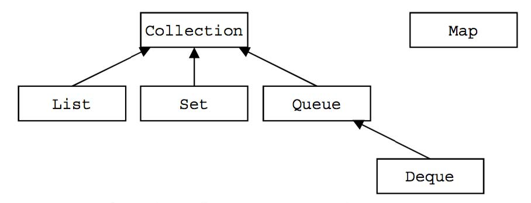
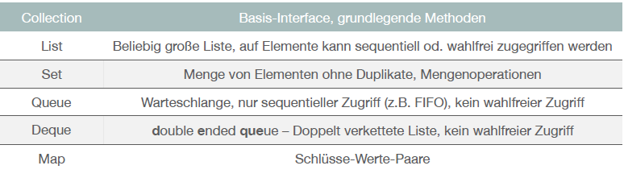
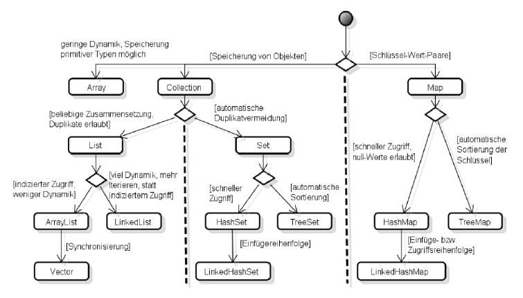
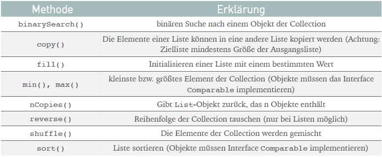

# 4.2. Collections-API

## Grundlagen
* Collections (=Container) sind Datenstrukturen, die eine Gruppe von Daten zu einer Einheit zusammenfassen
* Collections sind standardmäßig nicht synchronisiert!
* Datenelemente müssen gleichen Typ haben = generischer Datentyp
* `foreach`-Schleifen können bei Collections verwendet werden (nur Lesezugriff!)


## Collection: Unterschiede und welche gibt es?


* Listen
  - Methoden
    - `add()`, `get()`, `clear()`, `contains()`, `isEmpty()`, `remove()`, `size()`, `toArray()`
`  - Durchlaufen mittels Iterator möglich, wenn Elemente geändert werden sollten
```java
  // Iterator-Objekt „besorgen“
  Iterator<...> iter = arrList.iterator();
  // Durchlauf durch gesamte Collection
  while(iter.hasNext()) {
  // aktuelles Element
  curr = iter.next();
  // mach was mit dem Element
  ...
  }
```
  - ArrayList
    - Elemente linear hintereinander
    - Dynamisch, d.h. zur Laufzeit lassen sich Elemente löschen + hinzufügen
  - LinkedList
    - Doppelt verkettete Liste
    - Sehr schnell bei Einfügen/Löschen

* Set
  - Methoden
    - `add()`, `clear()`, `contains()`, `isEmpty()`, `remove()`, `size()`, `toArray()`
    - `menge1.addAll(menge2)`
      - Vereinigungsmenge von menge1 und menge2
    - `menge1.containsAll(menge2)`
      - true, wenn menge1 eine Untermenge von menge2 ist.
    - `menge1.removeAll(menge2)`
      - Differenz beider Mengen gebildet.
    - `menge1.retainAll(menge2)`
      - Es wird der Durchschnitt beider Mengen bestimmt
  - HashSet
    - Das gespeicherte Objekt sollte `hashCode()`-Methode überschrieben haben
    - Wenn kurzer Zugriff notwendig
    - Basieren auf Hash-Tabellen
  - TreeSet
    - Methoden
      - `first()`, `last()`
    - Das gespeicherte Objekt muss das Interface `Comparable` implementieren
      - int compareTo(T o)
      - Rückgabewert: gleich 0, größer > 0, kleiner < 0
    - Geordnete Speicherung
* Map
  - Methoden
    - `put(key,value)`, `get(key)`, `remove(key)`, `clear()`, `isEmpty()`, `size()`, `containsKey()`, `containsValue()`, `entrySet()`, `keySet()`, `values()`
  - ForEach-Schleife für Ausgabe
  - HashMap
    - Das gespeicherte Objekt sollte `hashCode()`-Methode überschrieben haben
    - Wenn kurzer Zugriff notwendig
  - TreeMap
    - Das gespeicherte Objekt muss das Interface `Comparable` implementieren
      - int compareTo(T o)
      - Rückgabewert: gleich 0, größer >0, kleiner <0
    - Sortierung: nur Wert des Schlüssels, nicht Element!

## Collection: Auswahl


## equals -> hashcode -> comparable Zusammenhang
* `compareTo()`
  * Benötigt für TreeMap / TreeSet

* `hashcode()` vs `equals()`
  * Zwei Objekte sind identisch, wenn equals `true` zurückgibt.
  * Zwei gleiche Hashcodes müssen nicht bedeuten, dass die Objekte gleich sind.

## Collections
* enthält nur statische Methoden
* Algorithmen und Hilfsmethoden




## Queue/Stack
* Queue
  - FIFO -> First In, First Out
  - Spezial: DeQueue
    - DoubleEndedQueue
    - An beiden Enden können Elemente angefügt und entnommen werden
  - Methoden
    - element: Element vom Kopf der Queue, wenn leer dann NoSuchElementException
    - peek: wie element(), nur null, falls leer
    - remove: wie element(), nur mit entfernen des Elements
    - poll: wie peek, nur mit entfernen des Elements
    - offer: fügt Element in Queue ein
* Stack
  - LIFO -> Last In, First Out
  - Methoden
    - push: auf Stapel legen
    - pop: von Stapel nehmen
    - peek: oberstes Element vom Stapel ansehen


## Threadsave Collections
* Siehe [3.3. Threads und Synchronisierung](../thema03/kap03.md)
