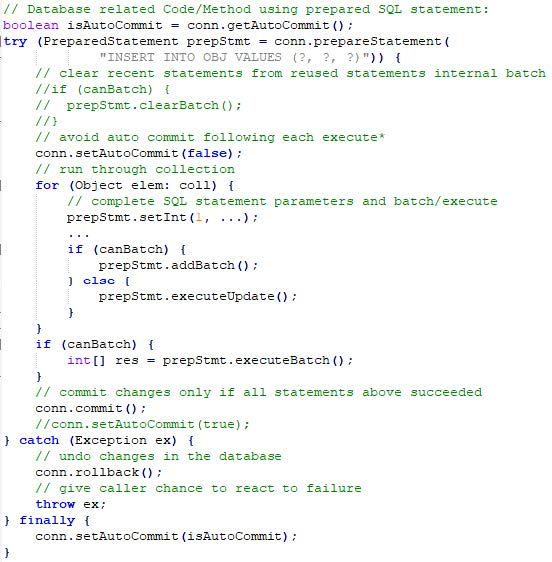

# 4.3. Zugriff auf SQL Datenbanken (JDBC)

## Allgemein
* Standard-Schnittstelle für Zugriff auf relationale DB mittels SQL und Java
* Der jeweilige Treiber muss heruntergeladen und in IntelliJ unter Project Structure - Settings - Libraries hinzugefügt werden.
*

## Architektur
* 2-stufig
  - Client greif tdirekt auf DB zu
* 3-stufig
  - Trennung: Anwendungslogik und Benutzeroberfläche bzw. Datenverwaltung
  - Client kommuniziert mit Applicationserver, der greift auf Datenbank zu

## Connection
* Klassen:
  - DriverManager:
    - Laden des JDBC-Treibers
    - Aufbau der Datenbankverbindung
  - SQLException:
    - Behandlung im Fehlerfall
* Interfaces
  - Connection: repräsentiert eine DB-Verbindung
  - Statement: führt SQL Anweisungen über die DBVerbindung aus
  - ResultSet: Methoden, um auf das Ergebnis der SQLAbfrage
zuzugreifen
* Properties
  - externes Property File für Verbindungsdaten
    - „dbconnect.properties“
  - Siehe [3.1. Sockets](../thema03/kap01.md)

## Datentypen

| JDBC Typ  | Java Typ             | Java Object-Typ      |
|-----------|----------------------|----------------------|
| TINYINT   | byte                 | java.lang.Byte       |
| SMALLINT  | short                | java.lang.Short      |
| INTEGER   | int                  | java.lang.Integer    |
| BIGINT    | long                 | java.lang.Long       |
| REAL      | double               | java.lang.Double     |
| FLOAT     | double               | java.lang.Double     |
| DOUBLE    | double               | java.lang.Double     |
| DECIMAL   | java.math.BigDecimal | java.math.BigDecimal |
| NUMERIC   | java.math.BigDecimal | java.math.BigDecimal |
| DATE      | java.sql.Date        | java.sql.Date        |
| TIME      | java.sql.Time        | java.sql.Time        |
| TIMESTAMP | java.sql.Timestamp   | java.sql.Timestamp   |

## Verwendung
* Datenbankverbindung aufbauen
  - `Connection con = DriverManager.getConnection(url, user, pwd);`
  - Zugriff auf DB erfolgt dann über Connection-Objekt con
* Infos über DBMS abfragen:
  - DatabaseMetaData getMetaData() throws SQLException
* Statement Object erzeugen
  - `Statement stmt = con.createStatement();`
* SQL-Anweisung ausführen
  - Abfrage: `ResultSet rs = stmt.executeQuery(“SELECT * FROM CUSTOMER“);`
  - Änderung: `stmt.executeUpdate("INSERT INTO CUSTOMER VALUES (...)")`
      - Rückgabewert bei Insert/Update/Delete: Anzahl der geänderten Datensätze
* Ergebnis der SQL Abfrage
  - ResultSet mit resultSet.next() zeilenweise durchlaufen
  - Anfang: .first()
  - Ende: .last()
  - Spaltenzugriff über getXXX( ) Methoden
    - Spaltenindex bzw. Spaltenname als Parameter
    - Entsprechend den Java-Typen gibt es passende getter-Methoden in der Klasse ResultSet
      - getByte()
      - getInt()
      - usw.

```java
  ResultSet rs = stmt.executeQuery( "SELECT * FROM CUSTOMER" );
  while (rs.next()){
    System.out.printf( "%s, %s %s, %s %s \n", rs.getString(1), rs.getString(2),
    rs.getString(3), rs.getString(4), rs.getString(5));
  }
```

* Am Ende müssen ResultSets, Statements, PreparedStatements & Connection mit .close() geschlossen werden
  - Deswegen in der Management-Klasse das Interface 'AutoClosable' implementieren und die Management-Klasse in einem TryWithResources öffnen

## Transaktion
* Reihe von SQL Anweisungen
* überführt DB von konsistenten in neuen konsistenten Zustand
* Alle Anweisungen werden entweder
  - Durchgeführt = commit
  - Abgebrochen und zurückgenommen = roll back
* Standardmäßig ist AutoCommit aktiviert
  - jedes SQL Statement = eine einzelne Transaktion
  - Muss extra deaktiviert werden für Transaktionen
  - Vorheriger Stand sollte mit `connection.getAutoCommit()` gespeichert werden und nach erledigter Arbeit wieder auf den ursprünglichen Wert gesetzt werden
  - Danach muss `connection.setAutoCommit(false)` ausgeführt werden
* Commit/Rollback
  - Commit: Wenn Transaktion abgeschlossen ist und in die DB übernommen werden soll
  - Rollback: Es ist ein Fehler aufgetreten, die Änderungen sollen nicht übernommen werden

## PreparedStatements
* immer gleiche SQL-Anweisung im Hintergrund, nur Parameter ändern sich
* Beschleunigung, da
  - DB parst SQL Statement
  - bereitet Statement für Durchführung vor (vorkompiliert)
  - nur mehr Parameter wird ausgetauscht
* Schützt auch vor SQL-Injections
  - Die Abfrage und die Daten werden getrennt an den Datenbankserver gesendet
  - Die Wurzel von SQL-Injection liegt in der Vermischung von Code und Daten
    - Bsp:
```php
$spoiled_data = "1; DROP TABLE users;"
$query        = "SELECT * FROM users where id=$spoiled_data";
```
    - Ergibt `SELECT * FROM users where id=1; DROP TABLE users;` und löscht somit die Tabelle users

  - Kurz: Die Daten werden mit der zweiten Anfrage gesendet, die im Wesentlichen von der eigentlichen Abfrage getrennt ist: So kann das Programm nicht verändert und kein Schaden angerichtet werden.
* Erstellung sollte einmalig erfolgen und nicht bei jedem Aufruf der Methode
  - Parameter werden als Platzhalter „?“ im SQL String angegeben
  - `PreparedStatement preparedStatement = connection.preparedStatement("Insert into CUSTOMER VALUES (?,?,?)")`
* Vor Ausführung müssen die Parameter gesetzt werden
  - // idx von links mit 1 beginnend
  - `void setByte (int idx, byte x)`
  - `void setShort (int idx, short x)`
  - `void setInt (...)`
  - ...
  - Achtung bei `null`
    - `setNull(int idx, int sqlType)`
    - passender Typ aus java.sql.Types notwendig!
* Parameter können mittels `clearParameters()` gelöscht werden
* Ausführung
    - `ResultSet executeQuery() throws SQLException`
    - `int executeUpdate() throws SQLException`
* PreparedStatement können auch als Stapel ausgeführt werden
  - PreparedStatements können mit `.addBatch()` auf einem „Stapel“ für eine spätere Abarbeitung geparkt werden
  - Gesamter „Stapel“ wird per .executeBatch() als Gesamtes abgearbeitet und ausgeführt -> Performancegewinn



## Blobs
* Binary Large Objects
* Verwenden Streams zum Lesen/Schreiben
* BLOB speichern

```java
// idx ... Index des Platzhalters im SQL-String
// x ... InputStream (Lesen vom Datenträger: FileInputStream)
// length ... Größe der Datei in Byte
void setBinaryStream (int idx, InputStream x, int length) throws SQLException
```

* BLOB lesen

```java
InputStream getBinaryStream (int columnIndex) throws SQLException
InputStream getBinaryStream (String columnName) throws SQLException
```

## Beispiel
* [MovieManagement](https://github.com/htlw-5ahit/matura-sew-insy/tree/main/thema04/moviemanagement)