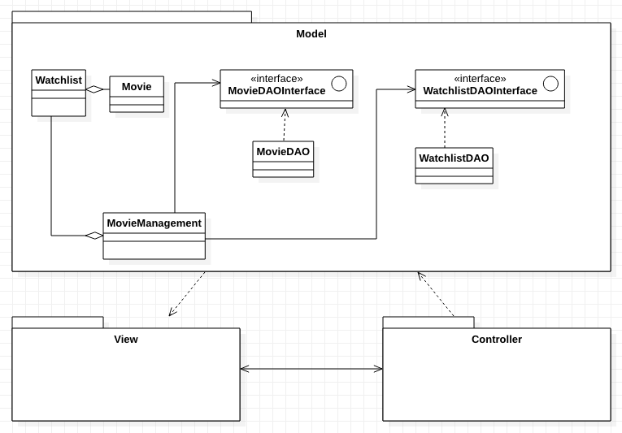

# 4505_MovieManagement_GUI

Die Verwaltung von Movies und Watchlists soll durch eine ansprechende grafische Oberfläche in JavaFX realisiert werden.



## FUNTIONALITÄT (Mindestanforderung)
- Anzeige der Daten in einer GUI inkl. Bild
- Navigation innerhalb der Daten (Watchlist wählen + dazugehörige Movies anzeigen, nächste/vorige Watchlist/Direktauswahl?)
- Hinzufügen neuer Datensätze (Movies inkl. Film-Cover, Erstellen neuer Watchlists)
- Löschen von Datensätzen
- Editieren von Datensätzen (Ändern vom Inhalt, Bilder, ...)
- Persistierung der Daten in HSQLDB gemäß vorhergehenden Übungen (DAO!)

## WICHTIG
- die Abfrage der Watchlists kann u.U. länger dauern und muss daher im Hintergrund ablaufen (vgl. Multithreading in JavaFX - Task/Service), bei allen anderen Abfragen ist dies nicht nötig
- Implementierung gemäß MVC
- Model (```MovieManagement```) beinhaltet Methoden: 
	- Movie zu Watchlist hinzufügen
	-  Movies einer Watchlist bereitstellen
	-  ...
- Der Zugriff auf die DAO-Objekte darf NICHT in den Ereignisbehandlern stattfinden, sondern muss im Model gekapselt werden.  
- Die Ereignisbehandler rufen nur die Methoden des Models (```MovieManagement```) für die tatsächliche Umsetzung der Benutzerinteraktion (speichern, laden, hinzufügen, ...) auf.
- Sämtliche Abhängigkeiten der UI-Elemente von bestimmten Zuständen (Speichern nur bei ungespeicherten Änderungen aktiv, Fortschrittsanzeigen, ...) sind in Form von Bindings zu realisieren.
- Layout/Optik ist nach persönlichen Vorstellungen zu implementieren, gerne auch List/TableViews bzw. “Aufhübschung” mittels CSS
