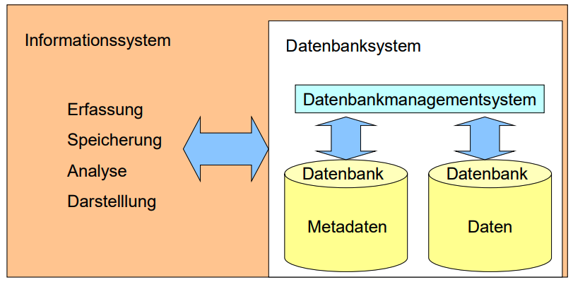
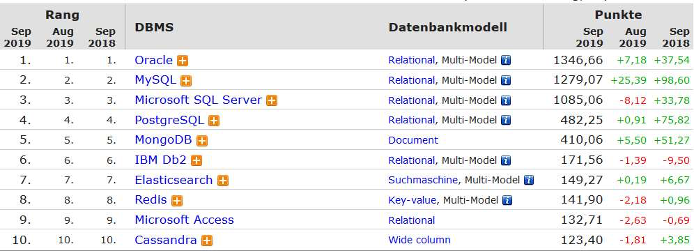
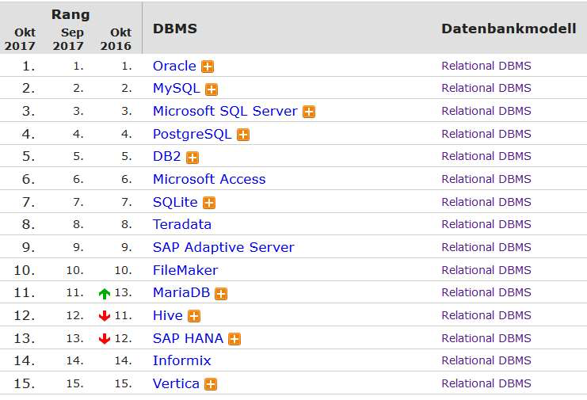

# 7.1.-2. Begriffe und Geschichte / Datenbanktypen

### Nenne Einsatzgebiete bzw. Vor- und Nachteile von Datenbanken.

* Vorteile:
    * Redundanz und Konsistenz
    * Mehrbenutzersystem
    * Datensichten
    * Strukturierte und beschriebene Daten (Daten und Metadaten)
    * Integritätsverletzungen (Transaktionen)
    * Sicherheit (allgemeiner Zugriff)
    * Trennung Daten und Anwendungen
    * Persistenz
* Nachteile:
    * Gefahr eines Overkills
    * Komplexität
    * Kosten
    * Qualifiziertes Personal
    * Geringe Effizienz
    * kann zu langsam sein für kritische Anwendungen
    * erhöhter Verwaltungsaufwand durch DBMS
    * Abfragesprache erfordert Wissen der relationalen Algebra

Quelle: [2-VorteileDBGeschichteKlassifikation (S. 6-8)](../archiv/insy-game/jahrgang3/2-VorteileDBGeschichteKlassifikation.pdf)

### Wann würden Sie eine Datenbank einsetzen?

* Plattform-/Anwendungsunabhängigkeit
* Zentrale Speicherung
* Zugriff aus dem Netzwerk
* Mehrbenutzersystem
* Speicherung von persistenten Daten
* Suche auf Datenbestand

Quelle: [2-VorteileDBGeschichteKlassifikation (S. 4)](../archiv/insy-game/jahrgang3/2-VorteileDBGeschichteKlassifikation.pdf)

### Was sind die grundlegenden Funktionen eines Datenbankmanagementsystems (DBMS) unabhängig vom unterstützen Datenmodell?

* Die Daten müssen persistent gespeichert werden.
* Es muss die unterschiedlichsten Suchzugriffe auf den Datenbestand geben.
    * Ich brauche verschiedenste Auswahl- bzw. Suchfunktionen für meine Datenbank, mit denen ich durch Beschreibung des gewünschten Ergebnisses die gewünschten Anzeigen erhalte.
* Des Weiteren brauchen wir also sogenannte Verwaltungsfunktionen für unsere Daten.
    * CRUD Funktionen: Create - Read - Update - Delete
* Sie soll so konstruiert sein, dass man die Daten redundanzfrei speichern kann.
* Ein Datenbanksystem muss für einen Mehr-Benutzer-Betrieb ausgelegt sein.

Quelle: [1-EinführungDatenbanksysteme.pdf (S. 7, 11, 13, 21, 23)](../archiv/insy-game/jahrgang3/1-Einf%C3%BChrungDatenbanksysteme.pdf)

### Was bedeuten die Begriffe Konsistenz, Redundanz und Integrität?

* Konsistenz
    * Widerspruchsfreiheit einer Datenbank
    * Korrektheit der gespeicherten Daten
* Redundanz
    * (überflüssige) mehrfache Speicherung gleicher Informationen (Datendopplung)
* Integrität
    * Daten fehlerfrei und vollständig beschreiben

Quelle:
* [https://www.mirko-hans.de/info/gk_12/db-systeme.htm](https://www.mirko-hans.de/info/gk_12/db-systeme.htm)
* [https://de.wikipedia.org/wiki/Konsistenz_(Datenspeicherung)](https://de.wikipedia.org/wiki/Konsistenz_(Datenspeicherung))
* [1-EinführungDatenbanksysteme.pdf (S. 20)](../archiv/insy-game/jahrgang3/1-Einf%C3%BChrungDatenbanksysteme.pdf) 

### Grenzen sie die Begriffe Datenbank, Datenmodell, Datenbankmanagementsystem und Informationssystem voneinander ab.

Quelle: [2-VorteileDBGeschichteKlassifikation (S. 3)](../archiv/insy-game/jahrgang3/2-VorteileDBGeschichteKlassifikation.pdf)

### Welche Typen von DBMS gibt es? Erläutern Sie die geschichtliche und technische Entwicklung.

* Netzwerk- und hierarchische Datenbanken
* Relationale Datenbanken
* Objektrelationale/Objektorientierte Datenbanken
* XML-Datenbanken
* NoSQL Datenbanken

Netzwerk- und hierarchische Datenbanken

* Erste Datenbanksysteme ca. 1960-1970
* Solche Systeme können mit einem Stammbaum verglichen werden.
* Es existiert ein Wurzelkoten, von dem sich aus wieder mehrere Knoten verzweigen können.
* Ähnlich den hierarchischen Datenbanken sind die Netzwerkdatenbanken strukturiert, wobei hier aber ein Kindknoten mehrere Elternknoten haben kann.
* Probleme:
    * N:M Beziehung schwer abbildbar
    * Struktur rasch unübersichtlich
* Seit den 1990er Jahren wird das Netzwerkdatenbankmodell vom relationalen Datenbankmodell mehr und mehr verdrängt.
* Eine Renaissance erlebt die hierarchische Datenspeicherung mit XML.

Relationale Datenbanken

* „Alles ist eine Tabelle“ -> Relationenalgebra
* Daten in Tabellen (Relationen) gespeichert, die weitgehend unabhängig voneinander sind.
* Eine Tabelle ist ein zweidimensionales Gebilde aus Spalten (columns) und Reihen (rows).
* Die Spalten stellen Attribute dar, in den Reihen werden jeweils die Werte eingetragen.
* Die Tabellen haben lediglich durch Schlüssel Beziehungen zueinander.

Objektorientierte Datenbanken

* Objektorientierte Systeme fassen strukturelle und verhaltensmäßige Komponenten in einem Objekttypzusammen und gelten als die nächste Generation von Datenbanksystemen.
* Eine Lücke wird geschlossen
    * Anwendung in einer objektorientierten Programmiersprache
    * ein klassisches relationales Datenbanksystem
* Bsp: db4o, ObjectStore
* Nachteile:
    * kein Einzelzugriff auf die Attribute aller Objekte
    * Wenig Unterstützung von Multiuser-Anwendungen
    * Kein einheitlicher Standard
    * Anfragen:
        * Zugriffspfade zu Objekten über mehrere Pfadarten (bspw. Vererbung und Assoziation)
        * Führt bei Schreiboperationen in der Sperrverwaltung zu einer exponentiellen Komplexität und Performanceproblemen. 
    * Geringe Verbreitung
* Bindeglied zwischen klassischen relationalen Datenbanken und Objektdatenbanken.
* Entität -> Objekt
* Entitätstyp -> Klasse
* Nutzen die Vorteile von objektorientierten Datenbanken hinsichtlich der Speicherung + Abfragesprache SQL
* Bsp: Cache

XML-Datenbanken

* Daten werden im XML-Format gespeichert.
* 2 Kategorien:
    * XML-enabled: Herkömmliche Datenbanksysteme (z. B. Relationale Datenbanksysteme, ...) die ein Mapping auf oder ins XML-Format erlauben.
    * Native XML-Datenbanksysteme: Diese Systeme speichern die Information, ähnlich wie bei der Speicherung von XML-Dokumenten im Dateisystem, direkt als XML-Dokumente ab.
* Umwandlung in XML entfällt
* Große Datenbasis -> schlechte Performance

Quelle: [2-VorteileDBGeschichteKlassifikation (S. 9-19)](../archiv/insy-game/jahrgang3/2-VorteileDBGeschichteKlassifikation.pdf)

### Welche gibt es derzeit noch am Markt? Welche sind relevant?

| Verbreitung allgemein | Verbreitung relational |
|-----------------------|------------------------|
|  |  |

Quelle: [2-VorteileDBGeschichteKlassifikation (S. 14-15)](../archiv/insy-game/jahrgang3/2-VorteileDBGeschichteKlassifikation.pdf)

### Warum und für welche Einsatzgebiete entstehen immer mehr Nischenprodukte? Nennen Sie Vor- und Nachteile. 

