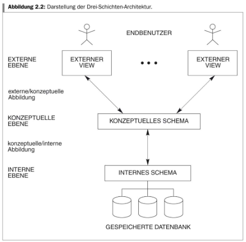
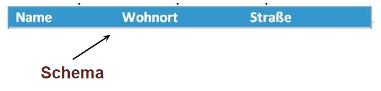

# 7.3. Architektur von Datenbanksystemen

## Was versteht man unter der „Drei Schichten Architektur“ nach ANSI-SPARC?

Quelle: [3-DBSArchitekturUnabhängigkeit (S. 10)](../archiv/insy-game/jahrgang3/3-DBSArchitekturUnabha%CC%88ngigkeit.pdf)

## Wieso hat man sich überhaupt für mehrere Schichten entschieden?

Benutzeranwendungen und physische Speicherung sollen voneinander getrennt werden.

Quelle: [3-DBSArchitekturUnabhängigkeit (S. 8)](../archiv/insy-game/jahrgang3/3-DBSArchitekturUnabha%CC%88ngigkeit.pdf)

## Erläutern Sie die einzelnen Schichten.

| Schicht | Beschreibung |
|---|---|
| Interne Ebene (internes Schema) | - beschreibt die physikalischen Speicherstrukturen der Datenbank (Datenspeicherung und Zugriffspfade). zB. Index - Beeinflussbar durch Indexes bzw. Shards - DBMS und darunter Betriebssystem|
| Konzeptuelle Ebene (konzeptuelles Schema) | - legt das Datenbankschema  (Metadatenmodell) fest - systemunabhängige Datenbeschreibung, d.h. sie ist unabhängig von den eingesetzten Datenbank- und Computersystemen. - Verbirgt Details der physische Speicherung - ER-Modell, Relationenmodell, Normalisieren -> Schema |
| Externe (View) Ebene (externes Schema) | Beschreibt nur den Teil an dem eine bestimmte Benutzergruppe interessiert ist und verbirgt den Rest z.B. SQL Statement - Berechtigungen, kleiner Ausschnitt der Daten für gewisse Benutzer, wie zB. durch Views  |

Quelle: [3-DBSArchitekturUnabhängigkeit (S. 9)](../archiv/insy-game/jahrgang3/3-DBSArchitekturUnabha%CC%88ngigkeit.pdf)

## Welche Gründe sprechen für dieses Modell?

Datenunabhängigkeit

* Änderung des Schemas einer Schicht erfordert keine Änderung des übergeordneten Schemas
* Die ANSI-SPARC macht logische und physische Datenunabhängigkeit durch Einführung der 3 Ebenen möglich
    * logische Datenunabhängigkeit: da externe Schema Anwendungen vor Änderungen des internen Schema (z.B. Änderungen am Schema) schützen
    * physische Datenunabhängigkeit: da konzeptuelles Schema Anwendungen vor Änderungen des internen Schemas (z.B. Tuning) schützt

Physische Datenunabhängigkeit

* ... ist die Fähigkeit, das interne Schema ändern zu können, ohne externe, konzeptionelle Schemas oder Anwendungsprogramme ändern zu müssen
* Änderungen an der physischen Speicher- oder der Zugriffsstruktur (beispielsweise das Anlegen oder Entfernen einer Indexstruktur) haben keine Auswirkungen auf die logische Struktur der Datenbasis, das Datenbankschema.
* z.B.: Datenbanktuning oder Erweiterung von Speicherstrukturen haben keine Auswirkungen auf Anwendungsprogramme

Logische Datenunabhängigkeit

* ... ist die Fähigkeit, das konzeptionelle Schema zu ändern, ohne externe Schemas oder Anwendungsprogramme ändern zu müssen.
* Logische Datenunabhängigkeit bedeutet, dass Anwendungen gegen Änderungen, die am Datenbankschema vorgenommen werden, immun sind.
* Logische Datenunabhängigkeit kann nur für einfache Modifikationen des Datenbankschemas realisiert werden
* beispielsweise lässt sich die Änderung eines Attributs mithilfe einer Sichtdefinition vor dem Anwendungsprogramm verbergen

Quelle: [3-DBSArchitekturUnabhängigkeit (S. 12-15)](../archiv/insy-game/jahrgang3/3-DBSArchitekturUnabha%CC%88ngigkeit.pdf)

## Welche Schicht hängt vom Betriebssystem ab?

Interne Ebene

## Braucht man ein Filesystem – wenn ja: Wer stellt es zur Verfügung und inwieweit kann sich dieses auf das Gesamtsystem auswirken?

* Betriebssystem stellt Dateisystem zur Verfügung.
* Interne Ebene bietet Schnittstelle zu diesem.

## Wo wird die Struktur der abzuspeichernden Informationen hinterlegt?

Datenbankschema legt die Struktur der abspeicherbaren Objekte fest.

Quelle: [3-DBSArchitekturUnabhängigkeit (S. 4)](../archiv/insy-game/jahrgang3/3-DBSArchitekturUnabha%CC%88ngigkeit.pdf)

## Inwieweit reflektiert sich diese Struktur in den Anwendungsprogrammen?

* Das Anwendungsprogramm richtet sich nach der Struktur.
* Bei Änderungen der Basistabellen muss das Anwendungsprogramm geändert werden, außer es werden Views verwendet.

## Wie können komplexe Strukturen vereinfacht dargestellt werden?

Views

## Was legt ein Datenbankschema fest?

* Datenbankschema legt die Struktur der abspeicherbaren Objekte fest.
* Das Schema sagt also nichts über die individuellen Datenobjekte aus.
* Datenbankschema -> Metadaten

Quelle: [3-DBSArchitekturUnabhängigkeit (S. 4)](../archiv/insy-game/jahrgang3/3-DBSArchitekturUnabha%CC%88ngigkeit.pdf)

## Was versteht man unter den Begriffen DDL/DML?

Datendefinitionssprache (DDL)

* Diese dient der Definition und der Veränderung des Datenschemas.
* Typische DDL-Operationen (mit den entsprechenden Schlüsselwörtern in der relationalen Datenbanksprache SQL) sind:
    * Erzeugen von Tabellen und Festlegen von Attributen (`create table ...`)
    * Ändern von Tabellen durch Hinzufügen oder Entfernen von Attributen (`alter table ...`)
    * Löschen ganzer Tabellen mitsamt Inhalt (!) (`drop table...`)

Datenmanipulationssprache (DML)

* Arbeitsmöglichkeiten mit Daten (Speichern, Suchen, Lesen, Ändern)
* Datenbankanfragen, welche Inhalte abfragen, aber keine Änderungen an den Daten vornehmen.
* Datenmanipulationen, die die Datenbank verändern, indem sie zum Beispiel Daten einfügen, löschen oder abändern.

Quelle: [3-DBSArchitekturUnabhängigkeit (S. 18-19)](../archiv/insy-game/jahrgang3/3-DBSArchitekturUnabha%CC%88ngigkeit.pdf)

## Wie reflektiert sich DDL/DML in der Architektur eines Datenbanksystems?

* DML -> Externe Ebene
* DDL -> Konzeptuelle Ebene

## Gehen Sie auf einige Modellierungskonzepte ein, die sich aus der Schichtenarchitektur ergeben.

* Entity-Relationship-Diagram (ER-Diagramm)
* Relationen Modell
