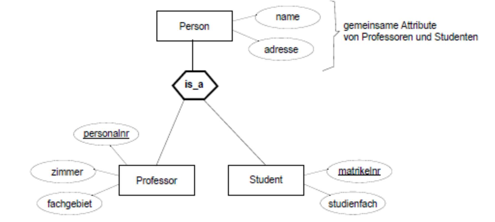

# 7.4. ER bzw. EER- Modell und Umsetzung

### Wie geht man bei der Erstellung eines ER-Modells vor?

### Welche Einsatzgebiete hat ein ER-Modell?

### Was ist eine Entität? Was ist ein Entitätstyp?

Entity

- Repräsentiert ein Objekt der realen Anwendungswelt,
- z.B. GDI ist eine Vorlesung
- Graphische Darstellung: 

Entity Type

- Definiert die Menge aller Entitäten einer Art
- z.B. Vorlesung ist der Entity Type für alle Vorlesungs-Entitäten
- Graphische Darstellung: 

Quelle: [4-ER-Modellierung-Basics (S. 7-8)](../archiv/insy-game/jahrgang3/4-ER-Modellierung-Basics.pdf)

### Was ist eine Beziehung („Relationship“), was ein Beziehungstyp?

Relationship

- Repräsentiert eine Beziehung zwischen Entitäten
- z.B. liest ist eine Beziehung zwischen Entitäten Rhetorik und Sokrates
- Graphische Darstellung: 

Relationship Type

- Definiert die Menge aller Beziehungen einer Art
- z.B. liest ist der Relationship Type für eine Beziehung zwischen Vorlesungen und Professoren
- Graphische Darstellung: 

Quelle: [4-ER-Modellierung-Basics (S. 7-8)](../archiv/insy-game/jahrgang3/4-ER-Modellierung-Basics.pdf)

### Erklären Sie anhand des Modells Ausprägung und Modell.

| Beispiel Universität | Ausprägung und Modell |
|----------------------|-----------------------|
|  |  |

Quelle: [4-ER-Modellierung-Basics (S. 5-6)](../archiv/insy-game/jahrgang3/4-ER-Modellierung-Basics.pdf)

### Welche Typen von Beziehungen können Entitäten eingehen?

- 1:1 Beziehung
- 1:N bzw. N:1 Beziehung
- N:M

Quelle: [4-ER-Modellierung-Basics (S. 19-21)](../archiv/insy-game/jahrgang3/4-ER-Modellierung-Basics.pdf)

## Was versteht man unter einer schwachen Entität?

Strong Entities

- „Normale“ oder strong Entities existieren autonom.
- D.h. sind eindeutig über den Primärschlüssel identifizierbar.

Weak Entities

- Bei sogenannten „schwachen“ oder weak Entities gilt diese nicht, sie sind
    * In Ihrer Existenz von einem anderen Entitytyp abhängig
    * Oft nur in Kombination mit dem Schlüssel dieses übergeordneten Entitytyps eindeutig identifizierbar.
    * Werden doppelt umrahmt.

Beispiel:

- Entitätstyp `Raum` ist existenzabhängig von Entitätstyp `Gebäude`.

Quelle: [6-ER-Modellierung-KonsolidierungWeakStrongEntitiesGeneralisierung (S. 4-5)](../archiv/insy-game/jahrgang3/6-ER-Modellierung-KonsolidierungWeakStrongEntitiesGeneralisierung.pdf)

### Was unter Spezialisierung/Generalisierung? Wie werden diese umgesetzt?

- Eigenschaften von ähnlichen Entity-Typen werden einem gemeinsamen Obertyp zugeordnet.
- Bei dem jeweiligen Untertyp verbleiben nur die nicht faktorisierbaren Attribute.
- Untertyp -> eine Spezialisierung des Obertyps
- Obertyp -> Generalisierung des Untertyps

| Beispiel | |
|----------------------|-----------------------|
|  |  |

- 1:1
    * Die Person muss ein Professor oder Student sein
- 1:c
    * Die Person kann ein Professor, Student aber auch nur eine Person sein
- 1:cm
    * Die Person kann Professor und Student sein.

Quelle: [6-ER-Modellierung-KonsolidierungWeakStrongEntitiesGeneralisierung (S. 7-10)](../archiv/insy-game/jahrgang3/6-ER-Modellierung-KonsolidierungWeakStrongEntitiesGeneralisierung.pdf)

### Erklären rekursive Datenstrukturen im ER-Modell.

### Welche Beziehungen (Kardinalitäten!) können unmittelbar als Relationenschema (im Relationenmodell) dargestellt werden?

### Was muss ich bei der Umsetzung der Beziehungen beachten?

### Wie können „schwache Entitäten“ als ER-Diagramm bzw. als Tabellenschema modelliert werden?

### Warum dürfen/sollen Beziehungen nicht in Beziehung zu anderen Beziehungen stehen?

### Was versteht man in diesem Zusammenhang unter „Uminterpretation“?

### Wie werden Rekursionen in ein relationales Modell umgesetzt?

### Welche Notationen bietet das ER-Modell? Was sind die Unterschiede? 

- Krähenfußnotation
    * Kommt aus dem Software Engineering
    * z.B.: MySQL Workbench

- Intervallnotation oder (min,max) Notation
    * Es werden Ober- und Untergrenzen angegeben.
    * Feinere Spezifizierung , z. B. möglich: 4..6 Räder pro Fahrzeug
    * Falls das Intervall nur einen Wert enthält (z.B. 1..1),
    * wird oft nur der Wert 1 geschrieben.
    * (min,max) Notation: 1..n möglich=> (1,*)

- Modifizierte Chen-Notation (MC-Notation)
    * Die Modifizierte Chen-Notation (Modified Chen Notation, MC-Notation) ist eine Erweiterung der Chen-Notation.

| 1:1, 1:c und c:c Beziehung | 1:m, 1:mc und c:m Beziehung |
|----------------------------|-----------------------------|
|        |        |

| c:cm Beziehung | m:m, m:mc und mc:mc Beziehung |
|----------------|-------------------------------|
|          |

- UML Klassendiagramm als Datenmodell

Beispiele:

Quelle: [5-ER-Modellierung-Modellerstellung_Notationen (S. 10-18)](../archiv/insy-game/jahrgang3/5-ER-Modellierung-Modellerstellung_Notationen.pdf)