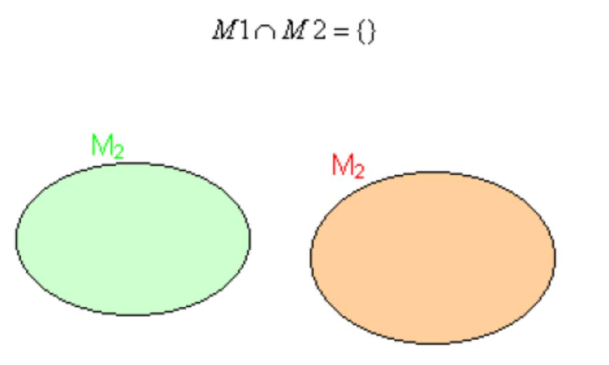

# 8.1. Relationenalgebra

### Auf welchen mathematischen Grundlagen beruht das relationale Datenmodell?

* Mengenlehre
* Relation

Quelle: [https://de.wikipedia.org/wiki/Relationale_Algebra](https://de.wikipedia.org/wiki/Relationale_Algebra)

### Wozu brauche ich die Relationenalgebra?

* Um Daten aus Mengen (Tabellen) abfragen zu können, werden die Operationen der relationalen Algebra benötigt.

Quelle: [https://www.hdm-stuttgart.de/~riekert/lehre/db-kelz/chap7.htm](https://www.hdm-stuttgart.de/~riekert/lehre/db-kelz/chap7.htm)

### Welche mathematischen Funktionen gibt es und wie funktionieren sie?

* Durchschnitt (Schnittmenge, Schnitt)
    * Die Schnittmenge zweier Mengen A und B besteht aus allen Elementen, die in jeder der beiden Mengen enthalten sind (also sowohl in A als auch in B).

| Menge | Diagramm |
|-------|----------|
|  |  |

* Vereinigung (Vereinigungsmenge)
    * Die Vereinigungsmenge aus zwei Mengen A und B erhält man, indem man alle Elemente zusammenfasst, die in der einen oder in der anderen Menge enthalten sind (oder möglicherweise auch in beiden).

| Menge | Diagramm |
|-------|----------|
|  |  |

* Differenz
    * Die Differenz zweier Mengen M1 und M2 ist definiert als die Menge aller Elemente, die in M1, nicht aber in M2 enthalten sind.

| Menge | Diagramm |
|-------|----------|
|  |  |

* Komplement
    * Ist A eine Teilmenge von B, so heißt die Differenz auch Komplement von B in A

* Symmetrische Differenz
    * Es handelt sich um die Menge aller Elemente, die jeweils in einer, aber nicht in beiden der beiden Mengen liegen. (XOR)

| Menge | Diagramm |
|-------|----------|
|  |  |

* Kartesisches Produkt

| Menge | Beispiel | |
|-------|----------|----------|
|  |  |  |

Hierbei ist die Reihenfolge entscheidend. `(1|a)` ist somit kein Element von `M1 x M2`, während `(a|1)` sehr wohl ein Element von `M1 x M2` ist.

* Potenzmenge
    * Eine Potenzmenge P(M) enthält alle möglichen Teilmengen von M, sowie die leere Menge.

* Disjunkte Mengen
    * Ist der Durchschnitt zweier Mengen M1 und M2 leer, so heißen diese Mengen disjunkt.

* Mächtigkeit
    * Die Mächtigkeit gibt an, wie viele Elemente eine Menge enthält.
    * Ist beispielsweise M eine Menge mit drei Elementen, so ist |M| = 3

Quelle: [SQL-Relationenalgebra (S. 11-21)](../archiv/insy-game/jahrgang3/SQL-Relationenalgebra.pdf)

### Was ist der Unterschied zwischen einer Relation und einer (mathematischen) Funktion?

* Relation
    * Eine Relation ist allgemein eine Beziehung, die zwischen Dingen bestehen kann, d.h. Elemente einer Menge werden zu einem oder mehreren Elementen einer anderen (zweiten) Menge in Beziehung gesetzt.
    * Eine Relation ist demnach eine Teilmenge des Kreuzprodukts der beiden Mengen.
    * Beispiel: Gegeben ist die Menge `A = {0,2,3,8,9}` und `B = {3,4,16,19}` und eine Relation R zwischen A und B mit R: ist Teiler von = `{(2,4),(2,16),(3,3),(8,16)}`

* Funktion
    * Eine Relation R wird zur Funktion f zwischen zwei Mengen A und B, wenn jedes Element x A genau ein Element y B zum Partner hat (x|y) f.
    * Eine Funktion drückt die Abhängigkeit einer Größe von einer anderen aus. Traditionell werden Funktionen als Regel oder Vorschrift definiert, die eine Eingangsgröße (Argument, meist x) in eine Ausgangsgröße (Funktionswert, meist y) transformiert (überführt).
    * Einfache Funktion: `y = 2x + 3`

Quelle: [SQL-Relationenalgebra (S. 22-23)](../archiv/insy-game/jahrgang3/SQL-Relationenalgebra.pdf)

### Was bedeuten "Attribut", "Wertebereich", "funktionale Abhängigkeit" und "voll funktionale Abhängigkeit"?

* Attribut
* Wertebereich
* funktionale Abhängigkeit
* voll funktionale Abhängigkeit

### Welche Eigenschaften haben Relationen?

Verweis:
* [https://www2.informatik.hu-berlin.de/~enseleir/tutorium/Relationen.pdf](https://www2.informatik.hu-berlin.de/~enseleir/tutorium/Relationen.pdf)
* [https://www.matheretter.de/wiki/eigenschaften-relationen](https://www.matheretter.de/wiki/eigenschaften-relationen)
* [https://www.cis.uni-muenchen.de/~finkf/mm/slides/10_relationsIII.pdf](https://www.cis.uni-muenchen.de/~finkf/mm/slides/10_relationsIII.pdf)

### Welche sind die im Relationen-Modell verfügbaren relationalen Operatoren und welche sind die Mengenoperatoren.

* Mengenoperationen
    * Vereinigung
    * Schnittmenge (Intersection)
    * Differenz
    * Symmetrische Differenz
* Kartesisches Produkt (Kreuzprodukt)
* Projektion
* Selektion
* Join
* Umbenennung
* Division

Quelle: [https://de.wikipedia.org/wiki/Relationale_Algebra](https://de.wikipedia.org/wiki/Relationale_Algebra)

### Wie sind diese definiert?

Frage????? [https://www.hdm-stuttgart.de/~riekert/lehre/db-kelz/chap7.htm](https://www.hdm-stuttgart.de/~riekert/lehre/db-kelz/chap7.htm)
