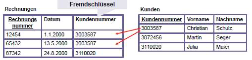

# 8.2. Grundlagen des relationalen Datenmodells

## Was ist die Ausgangsbasis für die Umsetzung eines relationalen Modells?

ER-Modell

## Wieso brauche ich beide Modelle?

?

## Erklären Sie die wichtigsten Teile des relationalen Modells (Attribut, Tupel, Domäne, Relation, Relationenschema)

* Attribut
    * Jedes Tupel besteht aus einer großen Reihe von Eigenschaften (Attributen), den Spalten der Tabelle.
* Tupel
    * Jede Zeile (auch Tupel genannt) in einer Tabelle ist ein Datensatz.
* Domäne
    * Zu jdem Attribut gibt es eine Menge, den Wertebreich (domain).
    * Notation: `dom(A)` ist der Wertbereich von `A`
    * Beispiel: Das Attribut `GESCHLECHT` hat den Wertebereich `dom(GESCHLECHT) = {männlich, weiblich}`
* Relation
    * Tabelle, in welcher Datensätze abgespeichert werden.
* Relationsschema
    * Ein Relationsschema legt dabei die Anzahl und den Typ der Attribute für eine Tabelle fest.

Quelle:
* [https://de.wikipedia.org/wiki/Relationale_Datenbank](https://de.wikipedia.org/wiki/Relationale_Datenbank)
* [7-Relationenmodell-Einführung (S. 9)](../archiv/insy-game/jahrgang3/7-Relationenmodell-Einfu%CC%88hrung.pdf)

## Wie lauten die Regeln zur Umsetzung?

?

## Was ist ein Primärschlüssel (Synonym: Identifikationsschlüssel)

* Der Primärschlüssel kommt in relationalen Datenbanken zum Einsatz und wird zur eindeutigen Identifizierung eines Datensatzes verwendet.
* Der für den Anwendungsfall zur Identifikation tatsächlich ausgewählte Schlüsselkandidat.
* Währende der gesamten Existenz eines Objekts in einer Datenbank darf der Primärschlüssel nicht verändert werden.
* Englisch: Primary-Key
* Darstellung: Wird unterstrichen

Quelle:
* [https://www.datenbanken-verstehen.de/datenmodellierung/primaerschluessel/](https://www.datenbanken-verstehen.de/datenmodellierung/primaerschluessel/)
* [7-Relationenmodell-Einführung (S. 16)](../archiv/insy-game/jahrgang3/7-Relationenmodell-Einfu%CC%88hrung.pdf)

## Was sind die wichtigsten Eigenschaften eines Primärschlüssels?

* eindeutige Identifikation des Tupels
* Unique
* Eine minimale(!) Menge von Attributen, welche das zugeordnete Entity eindeutig innerhalb aller Entities seines Typs identifiziert

Quelle: [7-Relationenmodell-Einführung (S. 16)](../archiv/insy-game/jahrgang3/7-Relationenmodell-Einfu%CC%88hrung.pdf)

## Was ein Fremdschlüssel?

Bezieht sich ein(e) Attribut(gruppe) einer Relation auf den Primärschlüssel einer anderen, so wird es (sie) in der referenzierenden Relation Fremdschlüssel (foreign key) genannt.

Quelle: [7-Relationenmodell-Einführung (S. 23)](../archiv/insy-game/jahrgang3/7-Relationenmodell-Einfu%CC%88hrung.pdf)

## Warum brauche ich Fremdschlüssel?

Fremdschlüssel (strichliert) dienen zur Verknüpfung mehrerer Relationen.

Quelle: [7-Relationenmodell-Einführung (S. 23)](../archiv/insy-game/jahrgang3/7-Relationenmodell-Einfu%CC%88hrung.pdf)

## Wo stoßen relationale Datenmodelle an ihre Grenzen?

* Striktes Schema
* Nicht objektorientiert
* Segmentierung der Datensätze (Joins)
* Künstliche Schlüsselattribute

Quelle: [https://de.wikipedia.org/wiki/Relationale_Datenbank#Kritik_am_relationalen_Datenbankmodell](https://de.wikipedia.org/wiki/Relationale_Datenbank#Kritik_am_relationalen_Datenbankmodell)

## Warum ist das relationale Datenmodell so erfolgreich? 

* Einfaches Datenmodell
* Geringe Datenredundanz
* Einheitliche Abfragesprache
* Einfach erstellbar & flexible Einsatzgebiete

Quelle: [https://www.ionos.at/digitalguide/hosting/hosting-technik/relationale-datenbanken/](https://www.ionos.at/digitalguide/hosting/hosting-technik/relationale-datenbanken/)