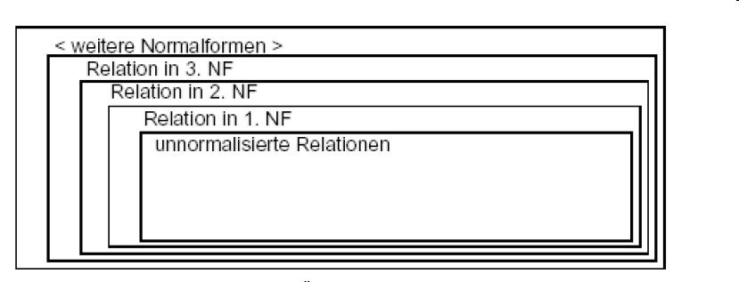

# 8.4. Normalformen

## Erläutern Sie die Bedingung für die ersten drei Normalformen (1NF, 2NF, 3NF) und die erforderlichen Schritte zur Transformation in diese Normalformen!

* 1. Normalform
    * Ein Relationenschema befindet sich in der 1. Normalform, wenn alle seine Attribute einfach und einwertig (atomar) sind.
* 2. Normalform
    * Ein System von Tabellen ist dann in der zweiten Normalform, wenn die Tabellen in der ersten Normalform sind und wenn zusätzlich alle NichtschlüsselAttribute voll funktional vom Primärschlüssel abhängig sind.
    * Hinweis: Die 2.Normalform kann nur verletzt werden, wenn der Primärschlüssel aus mehr als einem Attribut zusammengesetzt ist.
    * Auflösung: Felder, die nur von einem Schlüsselteil abhängen, müssen separat modelliert werden.
* 3. Normalform
    * Ein Relationenschema befindet sich in der 3. Normalform, wenn es in der 2. Normalform ist und kein Attribut, das nicht zum Primärschlüssel gehört, von diesem transitiv abhängt.
    * Erklärung: Alle Nichtschlüssel-Attribute sind voneinander unabhängig
    * Auflösung: Die transitiv abhängigen Datenfelder werden in weitere Tabellen ausgelagert

| Ausgangssituation | 1. Normalform | 2. Normalform | 3. Normalform |
|---|---|---|---|
|  |  |  |     |

Quelle:
* [Normalisieren (S. 22-36)](../archiv/insy-game/jahrgang4/Normalisieren.pdf)
* [https://www.datenbanken-verstehen.de/datenmodellierung/normalisierung/erste-normalform/](https://www.datenbanken-verstehen.de/datenmodellierung/normalisierung/erste-normalform/)
* [https://www.datenbanken-verstehen.de/datenmodellierung/normalisierung/zweite-normalform/](https://www.datenbanken-verstehen.de/datenmodellierung/normalisierung/zweite-normalform/)
* [https://www.datenbanken-verstehen.de/datenmodellierung/normalisierung/dritte-normalform/](https://www.datenbanken-verstehen.de/datenmodellierung/normalisierung/dritte-normalform/)

## Welche Vor- bzw. Nachteile ergeben sich, wenn sich ein ER-Modell in der 3. NF befindet?

Sie verhindert einerseits Anomalien und Redundanzen in Datensätzen und andererseits bietet sie genügend Performance für SQL-Abfragen.

Die Dritte Normalform ist oft ausreichend, um die perfekte Balance aus Redundanz, Performance und Flexibilität für eine Datenbank zu gewährleisten.

Quelle:
* [https://www.datenbanken-verstehen.de/datenmodellierung/normalisierung/dritte-normalform/](https://www.datenbanken-verstehen.de/datenmodellierung/normalisierung/dritte-normalform/)

## Gibt es noch weitere Stufen von Normalformen?

* Boyce Codd Normalform (BCNF)
* Vierte Normalform (4NF)
* Fünfte Normalform (5NF)

Quelle: [https://www.datenbanken-verstehen.de/datenmodellierung/normalisierung/](https://www.datenbanken-verstehen.de/datenmodellierung/normalisierung/)

## Was versteht man in diesem Zusammenhang unter „Anomalie“? Welche Anomalien kennen Sie – Führen Sie dazu Beispiele an!

Es gibt drei Anomalien die bei einem unsauber realisierten Datenbank-Entwurf auftauchen können:
* Löschanomalie
    * Bei der Löschanomalie kann es passieren, dass man durch das bewusste Löschen eines Datensatzes, unbewusst Informationen verliert, die man später wieder gebraucht hätte.
* Einfügeanomalie
    * Liegt ein fehlerhaftes Datenbankdesign vor, kann es bei der Einfüge-Anomalie passieren das Daten gar nicht gespeichert/angenommen werden, wenn beispielsweise für den Primärschlüssel kein Wert eingegeben wird, oder es führt bei einer nicht vollständigen Eingabe von Daten zu Inkonsistenz.
* Aktualisierungsanomalie /Änderungs-Anomalie
    * Bei der Änderungs-Anomalie oder auch Aktualisierungs-Anomalie genannt, werden gleiche Attribute eines Datensatzes nicht automatisch geändert. So entsteht eine Inkonsistenz der Daten. Man muss per Hand alle Einträge mühsam aktualisiern, es darf kein Fehler unterlaufen ansonsten führt es zur Inkonsistenz.

Quelle: [https://www.datenbank-grundlagen.de/anomalien.html](https://www.datenbank-grundlagen.de/anomalien.html)

## Wo stößt die Normalisierung an ihre Grenzen im praktischen Einsatz.

???