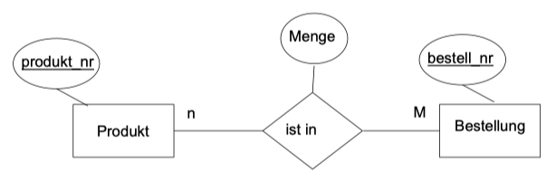

# 9.1. SQL und Standards

## Was besagt ANSI SQL92 – halten sich die DB-Anbieter daran?

* SQL ist ein ISO- und ANSI-Standard.
* Da sich SQL im Laufe ihrer Geschichte weiterentwickelt hat, kann man jedoch nicht von einem einzigen Standard sprechen.
* Die meisten Datenbankmanagementsysteme unterstützen SQL92.

Quelle: [SQL-1-DDL (S. 6)](../archiv/insy-game/jahrgang3/SQL-1-DDL.pdf)

## Wie sind die relationalen und die Mengenoperatoren in SQL umgesetzt?

* Elementare Operationen auf Relationen
    * Union
    * Intersection
    * Differenz
    * Join

#### Union

* Fügt die Zeilen zweier Tabellen mit gleicher Spaltenzahl in einer Tabelle zusammen.
* Die Namen der jeweiligen Spalten der zwei Tabellen müssen nicht identisch sein, lediglich der Datentyp bzw. Wertebereich des Inhalts
* Doppelte Zeilen werden unterdrückt!
* `SELECT id FROM t1 UNION SELECT id FROM t2`
* Mit `UNION ALL` werden sie angezeigt.
    * `SELECT id FROM t1 UNION ALL SELECT id FROM t2` 

#### Intersection (Schnittmenge)

* Vereinigt 2 Relationen und gibt jene Tupel in die Ergebnismenge, welche in beiden Relationen vorkommen.
* Es gelten die Regeln der Union.
* `(SELECT coloum_list FROM t1) INTERSECT (SELECT coloum_list FROM t2)`
* `INTERSECT` steht in MySQL nicht zur Verfügung, da es zum SQL 92 Intermediate Level gehört.
* Es kann aber nachgebildet werden, z. B. durch ein geschachteltes SELECT-Statement nachgebildet werden.
* `SELECT DESTINCT id FROM t1 WHERE id IN (SELECT id FROM t2)`

#### Differenz

* Liefert die Zeilen der ersten Tabelle, die in der zweiten Tabelle nicht enthalten sind.
* `SELECT id FROM t1 MINUS SELECT id FROM t2`
* MySQL: `SELECT id FROM t1 LEFT JOIN t2 USING (id) WHERE t2.id IS NULL`

#### Join

* Verknüpfung von Tabellen durch definierte Attribute

[siehe unten](#was-versteht-man-unter-einem-inner-join-was-unter-einem-crossrightleftfull-join)

Quelle: [SQL-1-DDL (S. 2-12)](../archiv/insy-game/jahrgang3/SQL-1-DDL.pdf)

## Wie erfolgt die Gruppenverarbeitung in SQL?


## Welche Aggregierungsfunktionen gibt es? (Formulieren Sie ein einfaches Beispiel für die Anwendung einer SQL-Funktion bei einer Gruppen-Selektion.)

| Befehl  | Erklärung                                           |
|---------|-----------------------------------------------------|
| `COUNT` | Anzahl von Tupeln, Werten oder verschiedenen Werten |
| `SUM`   | Summe der Werte                                     |
| `AVG`   | Durchschnitt der Werte                              |
| `MAX`   | Größter Wert                                        |
| `MIN`   | Kleinster Wert                                      |

```sql
SELECT kunden_nr, COUNT(*) FROM Bestellung GROUP BY kunden_nr;
```

```
Kunden_nr   count(*)
---------------------
101         1
103         2
105         1
```

Quelle: [Aggregatefunktionen_Groupby_Having (S. 7, 13)](../archiv/insy-game/jahrgang3/SQL-3-Aggregatefunktionen_Groupby_Having.pdf)

## Was versteht man unter einem Inner-Join, was unter einem Cross/Right/Left/Full-Join?

#### Cross Join

* Die häufigste Form einer Abfrage, die mehrere Tabellen umfasst, ist jener Fall, in Tabellen wieder zusammengeführt werden sollen.
* Das Verknüpfen ("joining") von Tabellen wird als JOIN bezeichnet.
* Es werden alle möglichen Kombinationen der Zeilen dieser Tabellen untereinander gebildet (kartesischen Produkt).
* Verbindet jede Zeile der ersten Tabelle mit jeder Zeile der zweiten Tabelle

```sql
SELECT *
FROM Mitarbeiter
CROSS JOIN Abteilung;
```

#### Join (alte Schreibweise)

* Da das verknüpfende Attribut in den beiden Ausgangstabellen denselben Namen hat,
    * muss es noch qualifiziert werden,
    * d.h. durch Voranstellen des Tabellennamens wird es eindeutig.
* Ressourcenaufwendig und sehr langsam!!

```sql
SELECT *
FROM Verlag, Postleitzahl
WHERE Verlag.plz = Postleitzahl.plz;
```

#### Inner Join

* Eine andere (neuere) Schreibweise für die diese Verknüpfung
* Verbindet Datensätze aus zwei Tabellen, sobald ein gemeinsames Feld dieselben Werte enthält.

```sql
SELECT * FROM Verlag
INNER JOIN Postleitzahl ON (Postleitzahl.plz = Verlag.plz);
```

#### Left Join

* Mit einem Left Join wird eine sogenannte linke Inklusionsverknüpfung erstellen.
* Linke Inklusionsverknüpfungen schließen alle Datensätze aus der ersten (linken) Tabelle ein, auch wenn keine entsprechenden Werte für Datensätze in der zweiten Tabelle existiert.

```sql
SELECT *
FROM Mitarbeiter
LEFT JOIN Projekte ON (Mitarbeiter.Nachname = Projekte.Nachname AND Mitarbeiter.Vorname = Projekte.Vorname);
```

#### Right Join

* Mit einem Right Join wird eine sogenannte rechte Inklusionsverknüpfung erstellen.
* Rechte Inklusionsverknüpfungen schließen alle Datensätze aus der zweiten (rechten) Tabelle ein, auch wenn keine entsprechenden Werte für Datensätze in der ersten Tabelle existieren.

```sql
SELECT *
FROM Mitarbeiter
RIGHT JOIN Projekte ON (Mitarbeiter.Nachname = Projekte.Nachname AND Mitarbeiter.Vorname = Projekte.Vorname);
```

#### Full Join

* Eine Kombination von Left Outer Join und Right Outer Join.

```sql
SELECT *
FROM Mitarbeiter
FULL JOIN Projekte ON (Mitarbeiter.Nachname = Projekte.Nachname AND Mitarbeiter.Vorname = Projekte.Vorname);
```

Quelle: [SQL-5-Joins](../archiv/insy-game/jahrgang3/SQL-5-Joins.pdf)

## Erklären Sie den Begriff „Unterabfrage“(„Subquery)“ anhand eines Beispiels.

* Schachtelung von Queries

```sql
SELECT id FROM t1
WHERE id IN (SELECT id FROM t2)`
```

## Welche Möglichkeiten zur Formulierung von Integritätsbedingungen gibt es in SQL (auf Tabellen- und auf Spaltenebene)?

* `FOREIGN KEY`
* `PRIMARY KEY`
* `UNIQUE`
* `CHECK`
* `NOT NULL`
* `DEFAULT`

Quelle: [SQL-1-DDL (S. 48)](../archiv/insy-game/jahrgang3/SQL-1-DDL.pdf)

## Was versteht man unter "Constraints"?

Mit Constraints werden Bedingungen definiert, die zwingend vom Wert einer Variablen erfüllt werden müssen, damit der Wert ins System übernommen werden kann.

Quelle: [https://de.wikipedia.org/wiki/Constraint](https://de.wikipedia.org/wiki/Constraint)

## Geben Sie ein Beispiel für eine Constraint.

```sql
CREATE TABLE produkte (
    produkt_nr integer NOT NULL,
    name text NOT NULL,
    preis numeric NOT NULL CHECK (preis > 0)
);
```

```sql
CREATE TABLE Produkt_Bestellung (
    bestell_nr int,
    produkt_nr int,
    menge int,
    PRIMARY KEY(bestell_nr,produkt_nr),
    FOREIGN KEY (bestell_nr) REFERENCES Bestellung(bestell_nr),
    FOREIGN KEY (produkt_nr) REFERENCES Produkt(produkt_nr)
);
```

Quelle: [SQL-1-DDL (S. 53, 64)](../archiv/insy-game/jahrgang3/SQL-1-DDL.pdf)

## Wie wirken sich Constraints aus?

* Einschränkung des Wertes eines Attributes
* Fehlermeldung beim Einfügen/Bearbeiten, sollten diese nicht eingehalten werden.

## Wo kann man Constraints festlegen bzw. einsehen (DDL / DML / DCL)

* DDL

## Welche Funktionen bietet SQL an (Beispiele) und wie können diese in Abfragen integriert werden?

* SQL AVG Funktion

```sql
SELECT Spaltenname1, AVG(Spaltenname2) 
FROM Tabellenname 
GROUP BY Spaltenname1
```

* SQL COUNT Funktion

```sql
SELECT COUNT(Spaltenname) 
FROM Tabellenname
```

* SQL MAX Funktion

```sql
SELECT MAX(Spaltenname) 
FROM Tabellenname
```

* SQL MIN Funktion

```sql
SELECT MIN(Spaltenname)
FROM Tabellenname
```

* SQL SUM Funktion

```sql
SELECT SUM(Spaltenname)
FROM Tabellenname
```

* SQL UCASE Funktion

```sql
SELECT UCASE(Spaltenname)
FROM Tabellenname
```

* SQL LCASE Funktion

```sql
SELECT LCASE(Spaltenname)
FROM Tabellenname
```

* SQL MID Funktion

```sql
SELECT MID(Spaltenname, Startposition, Zeichenlänge)
FROM Tabellenname
```

* SQL LEN Funktion

```sql
SELECT LEN(Spaltenname)
FROM Tabellenname
```

* SQL ROUND Funktion

```sql
SELECT ROUND(Spaltenname, Dezimalstellen nach dem Komma)
FROM Tabellenname
```

* SQL NOW Funktion

```sql
SELECT NOW() AS SPALTENNAME
FROM Tabellenname
```

* SQL FORMAT Funktion

```sql
SELECT FORMAT(Spaltenname, Format)
FROM Tabellenname
```

## Welche Beziehungen (Kardinalitäten!) können unmittelbar mit Hilfe von SQL und den Integritätsbedingungen in einem relationalem DBMS umgesetzt werden?

* Umsetzung einer m:n Beziehung mittels Constraints
    * Eine Tabelle kann mehrere Fremdschlüssel-Constraints enthalten.
    * Beispiel:
        * Tabellen mit Produkten und mit Bestellungen
        * Eine Bestellung kann mehrere Produkte aufnehmen.



```sql
CREATE TABLE Produkt_Bestellung (
    bestell_nr int,
    produkt_nr int,
    menge int,
    PRIMARY KEY(bestell_nr,produkt_nr),
    FOREIGN KEY (bestell_nr) REFERENCES Bestellung(bestell_nr) ON DELETE CASCADE,
    FOREIGN KEY (produkt_nr) REFERENCES Produkt(produkt_nr) ON DELETE RESTRICT
);
```

Quelle: [SQL-1-DDL (S. 62-64, 69)](../archiv/insy-game/jahrgang3/SQL-1-DDL.pdf)

## Bei welchen ist eine Zusatzprogrammierung erforderlich?

???

## Was versteht man unter einer Transaktion? 

* Liste von SQL-Statements, welche gemeinsam ausgeführt werden.
* Wirft ein Statement einen Fehler, wird zum Stand vor dem Ausführen der Liste zurückgesetzt. (Rollback)