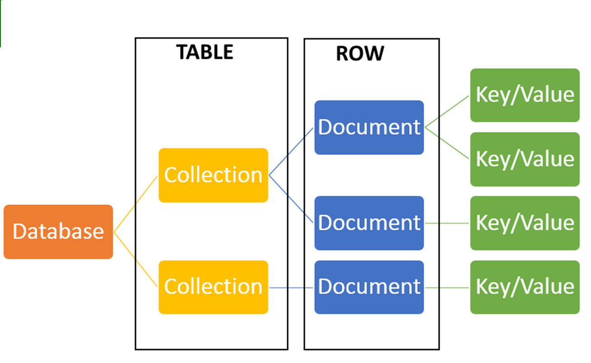
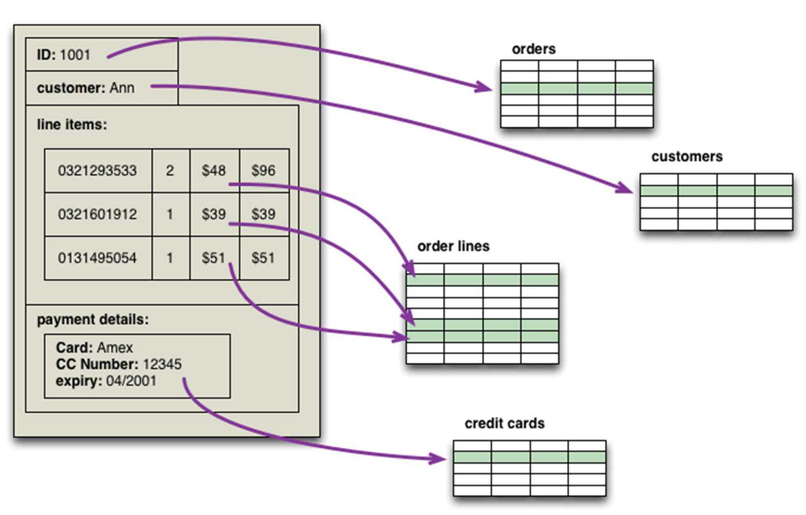
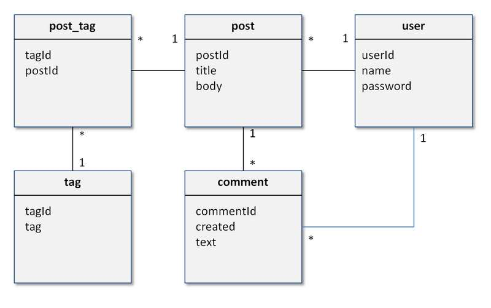
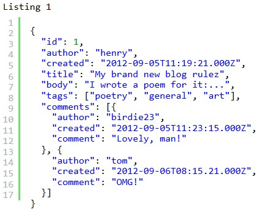
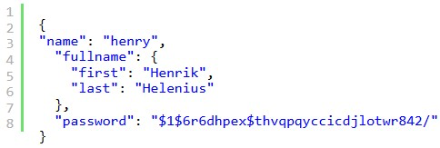
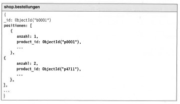
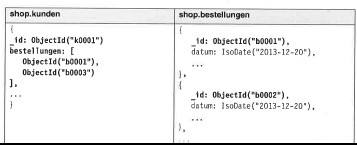

# 9.2.-3. MongoDB

### Grundaufbau MongoDB

Quelle: [MongoDB_1 (S. 6)](../archiv/insy-game/jahrgang5/MongoDB_1.pdf)

### Vergleich MongoDB und RDBMS

| RDBMS       | MongoDB               |
|-------------|-----------------------|
| Database    | Database              |
| Table, View | Collection            |
| Row         | Document (JSON, BSON) |
| Column      | Field                 |
| Index       | Index                 |
| Join        | Embedded Document     |
| Foreign Key | Reference             |
| Partition   | Shard                 |

Quelle: [MongoDB_1 (S. 7)](../archiv/insy-game/jahrgang5/MongoDB_1.pdf)

### Was ändert sich bei der Modellierung?

### Was sind Aggregate im Zusammenhang mit der Modellierung?

* Aggregate statt Relationen
* Key-Value-Stores und Dokumentendatenbanken sind „Aggregatorientiert“.
* Aggregat: „collection of related objects that we wish to treat as a unit“
* Aggregate vereinfachen die Verteilung der Daten: Replikation, Sharding

* Ich lege eine Strukturierung der Daten als Aggregate fest.
    * Bestellungen (orders) werden als Aggregate gespeichert.
    * Bestellungen sind leicht suchbar.

| Diagramm | Umsetzung: Post | Umsetzung: User |
|---|---|---|
|  |  |  |

Quelle: [MongoDB_2 (S. 4-6)](../archiv/insy-game/jahrgang5/MongoDB_2.pdf)

### Wie funktioniert die Umsetzung von Beziehungen?

| Beziehung | Darstellung | Umsetzung |
|---|---|---|
| 1:1 |  | // von a nach b: `var a = db.a.find(..)` `var b = db.b.find({_id:a.b_id})` // von b nach a `var b = db.b.find(..)` `var a = db.a.find({b_id:b._id})` |
| 1:n (Variante 1) |  | // bestellungen zum kunden `var kunde = db.kunden.find(…)` `var bestellungen = db.bestellungen.find({_id: {$in: kunde.bestellungen}})` // kunde zur bestellung `var bestellung = db.bestellungen.find(…)` `var kunde = db.kunden.find({bestellungen: bestellung._id})` |
| 1:n (Variante 2) |  | // bestellungen zum kunden `var kunde = db.kunden.find(…)` `var bestellungen = db.bestellungen.find({kunden_id: kunde._id}} )` // kunde zur bestellung `var bestellung = db.bestellungen.find(…)` `var kunde = db.kunden.find({_id: bestellungen: kunden._id})` |
| n:m |  |  |

Quelle: [MongoDB_2 (S. 12-18)](../archiv/insy-game/jahrgang5/MongoDB_2.pdf)

### Was ist Replication?

### Wie läuft sie ab?

### Was ist Sharding?

### Wie erfolgt die Auswahl eines Sharding Keys?