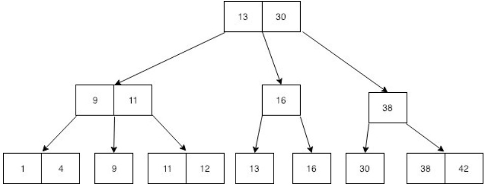

# 9.2. Views und Indizes

## Was sind Views?

Eine View ist eine SQL `SELECT`-Abfrage mit einem Namen.

Quelle: [Views-MySQL (S. 3)](../archiv/insy-game/jahrgang4/Views-MySQL.pdf)

## Eigenschaften und Vorteile

* Man erspart sich jedes Mal eine neue Abfrage zu machen.
* Man hat die Tabelle für Abfragen zur Verfügung wie man sie braucht.
* Berechtigungen können auf die View gesetzt werden, somit kann der Zugriff auf die ursprüngliche Tabelle entfallen.
* Speichern des `SELECT`-Statements, nicht der darin enthaltenen Daten!
* Views können auch ohne referenzierte Tabelle erstellt werden
* Vereinfachung für den Zugriff auf Daten
* Konsitent
* Views auf Views sind auch möglich

Quelle: [Views-MySQL (S. 4-5, 9)](../archiv/insy-game/jahrgang4/Views-MySQL.pdf)

## Wie erstelle ich eine View?

```sql
CREATE VIEW SoftwareVerkaeufe AS
    SELECT v.kaeufer, v.verkaeufer
    FROM   produkte p, verkaeufe v
    WHERE  p.produkt_id = v.produkt_id 
    AND    p.produkt = "Software"
```

Quelle: [https://de.wikipedia.org/wiki/Sicht_(Datenbank)](https://de.wikipedia.org/wiki/Sicht_(Datenbank))

## Wie bestimme ich die Ausführungsart

Der Algorithmus bestimmt, wie MySQL eine Ansicht verarbeitet, und kann einen der drei Werte `MERGE`, `TEMPTABLE` und `UNDEFINE` annehmen.

```sql
CREATE ALGORITHM=MERGE VIEW SoftwareVerkaeufe AS
    SELECT v.kaeufer, v.verkaeufer
    FROM   produkte p, verkaeufe v
    WHERE  p.produkt_id = v.produkt_id 
    AND    p.produkt = "Software"
```

Quelle: [Views-MySQL (S. 18)](../archiv/insy-game/jahrgang4/Views-MySQL.pdf)

## Erkläre MERGE, TEMPTABLE, UNDEFINED

#### MERGE

* Führe zunächst die Eingabeabfrage mit der `SELECT`-Anweisung in der Ansichtsdefinition zu einer einzigen Abfrage zusammen.
* Führe dann die kombinierte Abfrage aus, um das Ergebnis zurückzugeben einstellen.

```sql
CREATE ALGORTIHM=MERGE VIEW contactPersons(customerName, firstName, lastName, phone) AS SELECT customerName, contactFirstName, contactLastName, phone FROM customers;
```

```sql
/* you execute */
SELECT * FROM contactPersons WHERE customerName LIKE '%Co%';

/* mysql executes */
SELECT customerName, contactFirstName, contactLastName, phone FROM customers WHERE customerName LIKE '%Co%';
```

#### TEMPTABLE

* Erstelle zunächst eine temporäre Tabelle, um das Ergebnis der `SELECT`-Anweisung in der Ansichtsdefinition zu speichern.
* Führe dann die Eingabeabfrage für die temporäre Tabelle aus.

#### UNDEFINED

* MySQL bevorzugt nach Möglichkeit `MERGE` gegenüber `TEMPTABLE`, da `MERGE` oft effizienter ist als `TEMPTABLE`.

Quelle: [Views-MySQL (S. 19-22)](../archiv/insy-game/jahrgang4/Views-MySQL.pdf)

## Erkläre ALTER View, Updateable Views und Beispiel

#### ALTER VIEW

* Die MySQL-Anweisung `ALTER VIEW` ändert die Definition einer vorhandenen Ansicht.

```sql
ALTER ALGORITHM=MERGE VIEW salesOrders AS
    SELECT orderNumber, customerNumber, productCode, quantityOrdered, priceEach, status
    FROM orders
    INNER JOIN orderDetails USING (oderNumber); 
```

#### Updatable Views

* `INSERT`- oder `UPDATE`-Anweisung zum Einfügen oder Aktualisieren von Zeilen der Basistabelle über die aktualisierbare Ansicht.
* Um eine aktualisierbare Ansicht zu erstellen, muss die `SELECT`-Anweisung, die die Ansicht definiert, darf keines der folgenden Elemente enthalten:
    * `MIN`, `MAX`, `SUM`, `AVG`, `COUNT`, `DISTINCT`, `GROUP BY`, `HAVING`, `UNION`, Joins, Subqueries, keine nicht-updatable View, ...

```sql
/* erstellen der view */
CREATE VIEW officeInfo AS SELECT officeCode, phone, city FROM offices; 

/* beispiel: editieren einer tupel */
UPDATE officeInfo SET phone = '+33 14 723 5555' WHERE officeCode = 4; 
```

Quelle: [Views-MySQL (S. 24-26)](../archiv/insy-game/jahrgang4/Views-MySQL.pdf)

## Erkläre die WITH CHECK OPTION clause, Beispiel

* Die `WITH CHECK OPTION` verhindert, dass eine View Zeilen aktualisiert oder einfügt, die durch sie nicht sichtbar sind.
* Immer wenn Sie eine Zeile der Basistabellen über eine View aktualisieren oder einfügen, stellt MySQL sicher, dass die Einfüge- oder Aktualisierungsoperation mit der Definition der Ansicht übereinstimmt.

```sql
CREATE OR REPLACE VIEW dummy AS SELECT ... WHERE name LIKE ‘%ei%’;

INSERT INTO dummy(name, ...) VALUES ('Wurst', ..);
/* nun würde die tupel hinzugefügt werden */

CREATE OR REPLACE VIEW dummy AS SELECT ... WHERE name LIKE ‘%ei%’ WITH CHECK OPTION;

INSERT INTO dummy(name, ...) VALUES ('Wurst', ..);
/* nun würde die tupel nicht hinzugefügt werden -> error */
```

Quelle: [Views-MySQL (S. 29-30)](../archiv/insy-game/jahrgang4/Views-MySQL.pdf)

## Was sind Indizes?

* Obwohl eine Abfrage schnell sein kann, muss die Datenbank alle Zeilen der Tabelle durchsuchen, bis sie die Zeile findet.
* Wenn die Tabelle Millionen von Zeilen ohne Index enthält, würde der Datenabruf viel Zeit in Anspruch nehmen, um das Ergebnis zurückzugeben.
* Ein Index ist eine Datenstruktur wie B-Tree, die die Geschwindigkeit des Datenabrufs in einer Tabelle auf Kosten zusätzlicher Schreibvorgänge und Speicherplatz für deren Wartung verbessert.
* Der Query-Optimizer kann Indizes verwenden, um Daten schnell zu finden, ohne jede Zeile in einer Tabelle nach einer bestimmten Abfrage durchsuchen zu müssen.



Quelle: [Index-MySQL (S. 2)](../archiv/insy-game/jahrgang5/Index-MySQL.pdf)

## Wie erstelle ich einen Index?

```sql
/* Festlegen eines Index beim Erstellen der Tabelle */
CREATE TABLE t (
    c1 INT PRIMARY KEY,
    c2 INT NOT NULL,
    c3 INT NOT NULL,
    c4 VARCHAR(10),
    INDEX (c2, c3)
);

/* Nach der Erstellung der Tabelle einen Index definieren */
CREATE INDEX idx_c4 ON t(c4);
```

Quelle: [Index-MySQL (S. 4)](../archiv/insy-game/jahrgang5/Index-MySQL.pdf)

## Wie werden sie gespeichert?

* Beim Hinzufügen, Bearbeiten und Löschen von Tupel muss der B-Baum neu erstellt werden. 

## Composite Index

* Mit MySQL kann ein zusammengesetzter oder mehrspaltiger Index erstellt werden, der aus bis zu 16 Spalten besteht.
* Der Query-Optimizer verwendet die zusammengesetzten Indizes für Abfragen, die alle Spalten im Index testen, oder Abfragen, die die ersten Spalten, die ersten beiden Spalten usw. testen.

```sql
CREATE TABLE table_name (
    c1 data_type PRIMARY KEY,
    c2 data_type,
    c3 data_type,
    c4 data_type,
    INDEX index_name (c2,c3,c4)
);

CREATE INDEX index_name ON table_name (c2, c3, c4);´
```

Funktioniert für Abfragen
* c2 (`WHERE c2 = v2`)
* c2,c3 (`WHERE c2=v2 AND c3=v3`)
* c2,c3,c4 (`WHERE c2=v2 AND c3=v3 AND c4=v4`)

Quelle: [Index-MySQL (S. 19-21)](../archiv/insy-game/jahrgang5/Index-MySQL.pdf)

## Invisible indices

* Die unsichtbaren Indizes ermöglichen es, Indizes als nicht verfügbar=unsichtbar für den Abfrageoptimierer zu markieren.
* MySQL verwaltet die unsichtbaren Indizes und hält sie auf dem neuesten Stand, wenn sich die Daten in den mit den Indizes verknüpften Spalten ändern.
* Indizes sind standardmäßig sichtbar.

```sql
CREATE INDEX index_name ON table_name(c1,c2,...) INVISIBLE;

ALTER TABLE table_name ALTER INDEX index_name [VISIBLE | INVISIBLE];

/* Anzeigen aller Indizes */
SELECT index_name, is_visible
FROM information_schema.statistics
WHERE table_schema = ...
  AND table_name = ...;
```

Quelle: [Index-MySQL (S. 22-24)](../archiv/insy-game/jahrgang5/Index-MySQL.pdf)

## Descending index

* Ein absteigender Index ist ein Index, der Schlüsselwerte in absteigender Reihenfolge speichert.
* Der Abfrageoptimierer kann den absteigenden Index nutzen, wenn in der Abfrage eine absteigende Reihenfolge angefordert wird.

```sql
CREATE TABLE t (
    a INT NOT NULL,
    b INT NOT NULL,
    INDEX a_asc_b_asc (a ASC, b ASC),
    INDEX a_asc_b_desc (a ASC, b DESC),
    INDEX a_desc_b_asc (a DESC, b ASC)
);

EXPLAIN SELECT * FROM t ORDER BY a, b; -- use index a_asc_b_asc
```

Quelle: [Index-MySQL (S. 25-29)](../archiv/insy-game/jahrgang5/Index-MySQL.pdf)

## Use force Index

* Wenn in MySQL eine SQL-Abfrage senden wird, versucht der Query-Optimizer, einen optimalen Abfrageausführungsplan zu erstellen.
* Einer der wichtigsten Parameter für die Auswahl Welcher Index verwendet werden soll, ist die gespeicherte Schlüsselverteilung, die auch als Kardinalität bezeichnet wird.
* Führe eine `ANALYZE TABLE` aus, wenn die Tabellen sehr oft geändert wurden!
* Indizes, die der Query-Optimizer verwenden soll, können über `USE INDEX` empfohlen werden.
* Indizes, die der Query-Optimizer verwenden muss, können über `FORCE INDEX` festgelegt werden.

```sql
/* Use Index Hint */
SELECT select_list FROM table_name USE INDEX(index_list) WHERE condition;

/* Force Index */
SELECT * FROM table_name FORCE INDEX (index_list) WHERE condition;
```

Quelle: [Index-MySQL (S. 30-33)](../archiv/insy-game/jahrgang5/Index-MySQL.pdf)