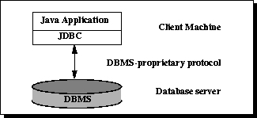

# 9.5. Anbindungsmöglichkeiten einer Datenbank (JDBC, JPA)

## Was ist JDBC?

* JDBC ... Java Database Connectivity
* Standard-Schnittstelle für Zugriff auf relationale DB mittels SQL und Java
* wird JDCBC verwendet: kein DB-spezifischer Code im Programmen
    * Abstraktionsschicht zwischen Java und SQL

Quelle: [4400_JDBC_v2 (S. 4)](../archiv/sew-helt/4400_JDBC_v2.pdf)

## Vorteile von der Verwendung von JDBC.

* Verwendung von SQL (Structured Query Language)
* Abstraktion des Datenbankservers (egal ob MariaDB, MySQL, HSSQL, MS SQL Server, ...)
* Einfache Möglichkeit, die Datenbank im Hintergrund auszutauschen
* Plattformunabhängig
* Gute Performance bei großen Datenmengen
* Eignet sich für kleinere Anwendungen

Quelle: [https://www.bigdata-insider.de/was-ist-jdbc-java-database-connectivity-a-727518/](https://www.bigdata-insider.de/was-ist-jdbc-java-database-connectivity-a-727518/)

## Welche JDBC-Architekturen gibt es?

#### 2-stufige Architektur

* Client Programm greift direkt auf DB zu (Netzwerk oder lokal)



#### 3-stufige Architektur

* Trennung: Anwendungslogik und Benutzeroberfläche bzw. Datenverwaltung
* Client kommuniziert mit Applicationserver, der greift auf Datenbank zu


Quelle: [4400_JDBC_v2 (S. 6-7)](../archiv/sew-helt/4400_JDBC_v2.pdf)

## Welche wird hauptsächlich verwendet?

* 3-stufige Architektur

## Grundaufbau der Anbindung an eine Datenbank in Java mit JDBC.


Quelle: [4400_JDBC_v2 (S. 10)](../archiv/sew-helt/4400_JDBC_v2.pdf)

## Web-Anwendung und JDBC

???

## Wo werden die Connectiondaten abgelegt?

* Properties-File

```
driver=org.hsqldb.jdbcDriver
url=jdbc:hsqldb:file:tutego
username=sa
password=
```

* Code zum Laden der Eigenschaften aus Property-File:

```java
String driver, url, user, pwd;

try (FileInputStream in = new FileInputStream("dbconnect.properties");) {
    Properties prop = new Properties();
    prop.load(in);

    driver = prop.getProperty("driver");
    url = prop.getProperty("url");
    user = prop.getProperty("user");
    pwd = prop.getProperty("pwd");
}
```

Quelle: [4400_JDBC_v2 (S. 22-24)](../archiv/sew-helt/4400_JDBC_v2.pdf)

## Wie wird diese aufgebaut?

```java
Connection connection = DriverManager.getConnection(url, user, pwd);
```

Quelle: [4400_JDBC_v2 (S. 25)](../archiv/sew-helt/4400_JDBC_v2.pdf)

## Was sind Alternativen zu JDBC

* ODBC ... Open Database Connectivity
* JPA ... Jakarta Persistence API
* Hibernate

## Erläutern Sie den Aufbau einer JPA-Anwendung


Quelle:
* [https://subscription.packtpub.com/book/application-development/9781788391078/3/ch03lvl1sec25/whats-new-in-jpa-22](https://subscription.packtpub.com/book/application-development/9781788391078/3/ch03lvl1sec25/whats-new-in-jpa-22)

## Was brauche ich dafür?

???

## Was ist automatisiert, was muss ich modellieren?

* Datenbank-Schema muss erstellt werden.
* Tabellen werden automatisch generiert, wenn sie als `@Entity` oder `@Table` annotiert sind.
* Lediglich die Beziehungen müssen händisch annotiert werden: `@OneToOne`, `@OneToMany`, `@ManyToOne`, `@ManyToMany`
* ID musst auch deklariert werden: `@Id`, sowie `@GeneratedValue(strategy = GenerationType.IDENTITY)`
* Es werden Default-Konstruktur, Getter und Setter werden benötigt.

## Woliegen die Herausforderungen?

* Beziehungen zwischen den Objekten
