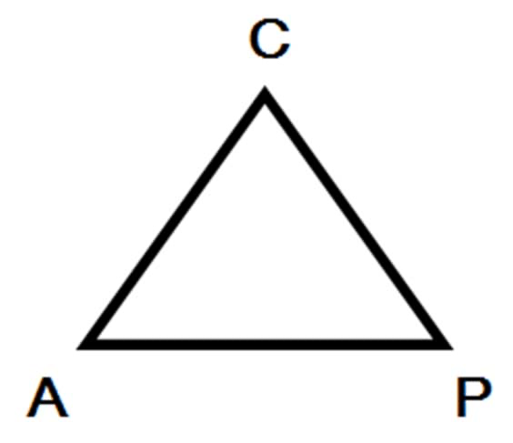
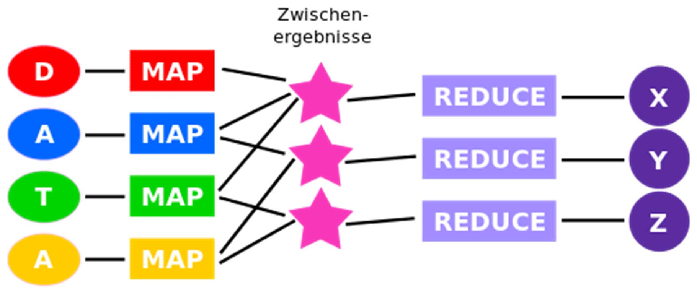
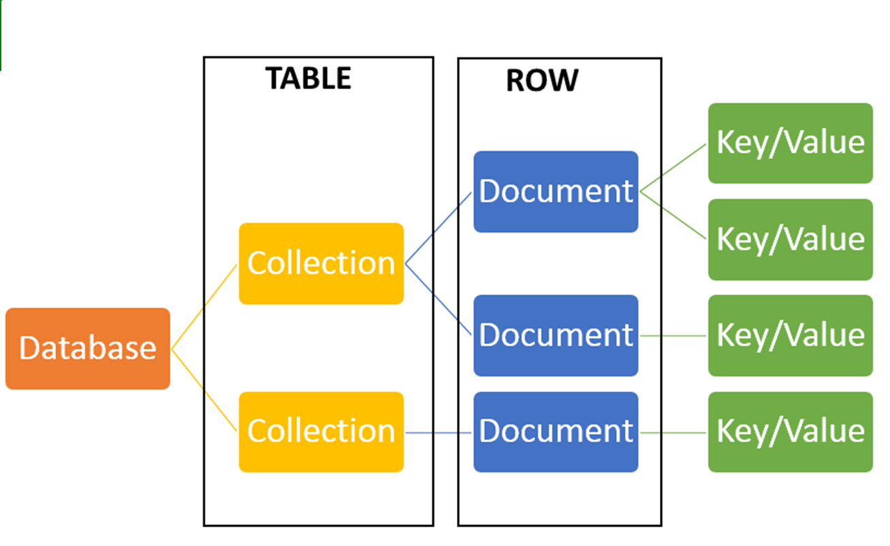
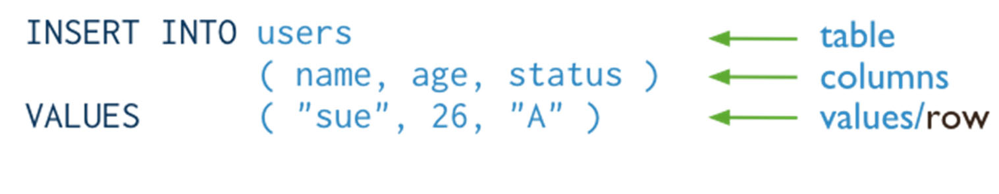
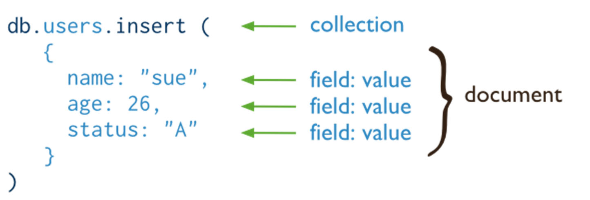
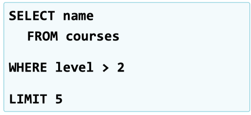
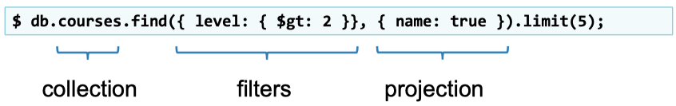
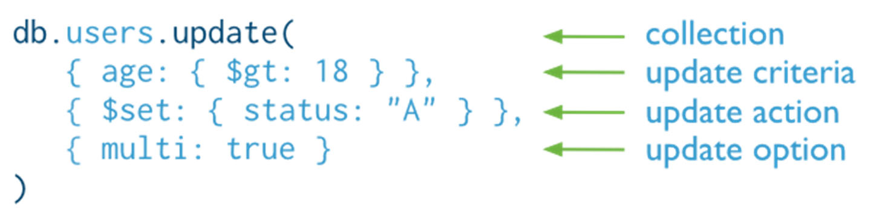
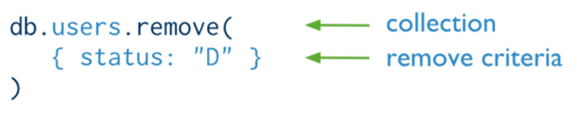

# 10.1. NoSQL Datenbanken

## Was bedeutet NoSQL

NoSQL = „not only SQL“

Quelle: [NoSQL-Teil1 (S. 8)](../archiv/insy-game/jahrgang5/NoSQL-Teil1.pdf)

## Eigenschaften

* verteilte und horizontale Skalierbarkeit, gleichrangige Knoten (verteilte Hardware -> hohe Ausfallsicherheit)
* kostengünstige Rechnersysteme zur Datenspeicherung
* kein relationales Datenmodell (kein SQL)
* schemafrei / schwache Schemarestriktionen
* keine Transaktionen (nach gewisser Zeit konsistenter Zustand)
* für spezifische Problemstellungen!

Quelle: [NoSQL-Teil1 (S. 8)](../archiv/insy-game/jahrgang5/NoSQL-Teil1.pdf)

## Einteilung mit Beispielen

* Document Store
    * MongoDB, CouchDB, RavenDB
* Key Value
    * Apache Hadoop, Riak, Redis, Membase, Amazon DynamoDB
* Graph
    * Neo4J, HyperGraphDB, OrientDB
* Column family
    * Cassandra, Apache HBase

Quelle: [NoSQL-Teil1 (S. 23-24)](../archiv/insy-game/jahrgang5/NoSQL-Teil1.pdf)

## Vergleich & Einsatzmöglichkeiten

* Document Store
    * Zusammengehörige Daten strukturiert in einem Dokument speichern
    * Struktur der Daten kann unterschiedlich sein, keine Schemen (Programmierung)
    * Keine Relationen zwischen Tabellen
    * Dokumente können gleiche oder unterschiedliche Schlüssel mit beliebigen Werten besitzen
    * Einfaches Hinzufügen neuer Felder
* Key/Value Store
    * Konzept der Konfigurationsdateien
    * Zuordnung eines Werts zu einem Schlüssel
    * Schneller Zugriff, hohe Datenmengen
    * In-Memory-Variante/On-Disk-Versionen
* Graph
    * Netz aus miteinander mit Hilfe von Kanten verbundenen Knoten
    * Kanten mit Bezeichnern erweitert -> Netz mit Bedeutung zwischen den Verbindungen (Semantic Web)
    * Problem: Pareto-Regel gilt auch hier: 20% der Knoten besitzen 80% Relevanz
    * Einsatz: komplex vernetzte Daten wie GIS-Answendungen (Navigation)
* Wide Column Store (spaltenorientiert)
    * Speicherung von Daten mehrerer Einträge in Spalten anstatt in Zeilen
    * Spalten mit ähnlichen oder verwandten Inhalten

Quelle: [NoSQL-Teil1 (S. 25-43)](../archiv/insy-game/jahrgang5/NoSQL-Teil1.pdf)

## CAP Theorem

Laut dem CAP-Theorem kann ein verteiltes System zwei der folgenden Eigenschaften gleichzeitig erfüllen, jedoch nicht alle drei.

* Konsistenz (C)
    * Alle Knoten sehen zur selben Zeit dieselben Daten.
* Verfügbarkeit (A)
    * Alle Anfragen an das System werden stets beantwortet.
* Partitionstoleranz oder Ausfalltoleranz (P)
    * Das System arbeitet auch bei Verlust von einzelnen Netzknoten weiter.

Quelle: [NoSQL-Teil1 (S. 14)](../archiv/insy-game/jahrgang5/NoSQL-Teil1.pdf)

## ACID und BASE im Vergleich

ACID

* Atomarität (Abgeschlossenheit)
    * Sequenz von Daten-Operationen entweder ganz oder gar nicht ausgeführt
    * Konsistenz heißt, dass eine Sequenz von Daten-Operationen nach Beendigung einen konsistenten Datenzustand hinterlässt
* Konsistenz
    * Konsistenter Datenzustand -> Sequenz von Operationen -> konsistenter Datenzustand
* Isolation (Abgrenzung)
    * Keine Beeinflussung nebenläufiger Daten-Operationen
* Dauerhaftigkeit
    * Dauerhafte Speicherung nach (erfolgreichem) Abschluss

BASE

* Basically Available
    * Die meisten Daten sind die meiste Zeit verfügbar
* Soft state
    * Die DB bietet eine entspannte Sicht auf Daten in Bezug auf die Konsistenz
* Eventually consistent
    * Die Daten werden schließlich auf alle zutreffenden Knoten kopiert, aber es ist nicht erforderlich, dass alle Knoten die ganze Zeit über identische Kopien beliebiger gegebener Daten verfügen.
    * Letztendlich nach einer möglichst kurzen Zeitspanne haben alle Teile eines verteiltes Systems wieder die gleiche Sicht auf die Daten.

| BASE                 | ACID                          |
|----------------------|-------------------------------|
| weiche Konsistenz    | harte Konsistenz              |
| Verfügbarkeit        | Isolation                     |
| best effort          | commit                        |
| Nährungen akzeptabel | Verfügbarkeit?                |
| einfache Entwicklung | komplexe Entwicklung (Schema) |
| schneller            | sicherer                      |

Quelle: [NoSQL-Teil1 (S. 18-20)](../archiv/insy-game/jahrgang5/NoSQL-Teil1.pdf)

## Erklären Sie MAP/Reduce und den Einsatz

* Programmiermodell von Google entwickelt
* MapReduce dient zur verteilten und parallelen Verarbeitung großer Mengen strukturierter und unstrukturierter Daten
* Divide-and-Conquer-Ansatz = verteilte Berechnungen über große Rechnercluster

Beispiel:
* Wir möchten alle Bücher in der Bibliothek zählen.
* Sie zählen Regal Nr. 1, ich Regal Nr. 2. Dies entspricht dem Vorgang „map“ (erfassen).
* Jetzt addieren wir unsere beiden Zählungen. Dies entspricht dem Vorgang „reduce“ (reduzieren).

Quelle: [NoSQL-Teil1 (S. 44-46)](../archiv/insy-game/jahrgang5/NoSQL-Teil1.pdf)

## MongoDB als NoSQL Beispiel. Eigenschaften

* MongoDB ist eine OpenSource Document Store Database
* leading NoSQL database
* schemafrei
* Speichern von JSON-style Objekten mit dynamischen Schema
* Rich, document-based queries (CRUD Operationen)
* Map/Reduce Unterstützung

Quelle: [MongoDB_1 (S. 4)](../archiv/insy-game/jahrgang5/MongoDB_1.pdf)

## CRUD Operationen im Überblick

| SQL                 | MongoDB                 |
|---------------------|-------------------------|
|  |    |
|  |      |
|  |  |
|  |  |

Quelle: [MongoDB_1 (S. 8-14)](../archiv/insy-game/jahrgang5/MongoDB_1.pdf)