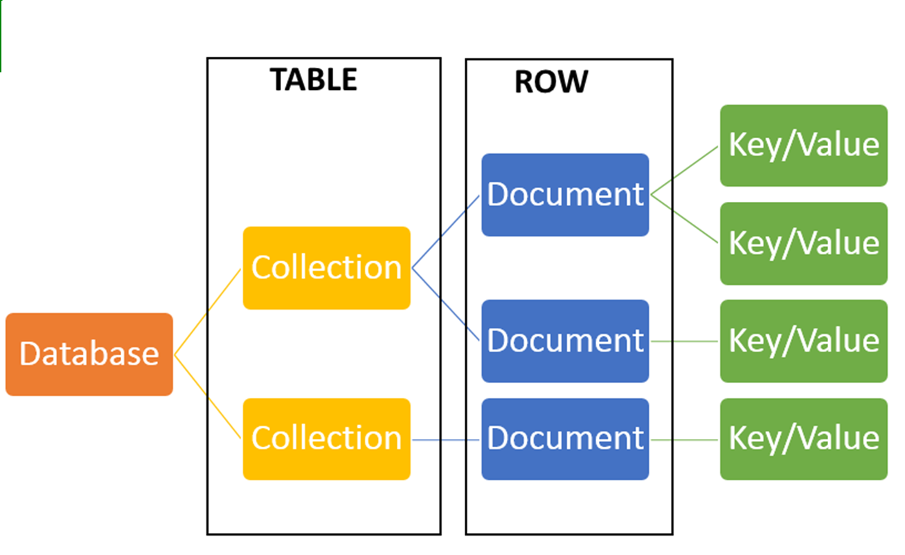
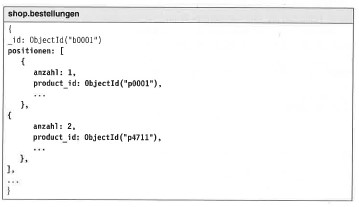

# 10.2.-3. MongoDB

## Grundaufbau MongoDB

Quelle: [MongoDB_1 (S. 6)](../archiv/insy-game/jahrgang5/MongoDB_1.pdf)

## Vergleich MongoDB und RDBMS

| RDBMS       | MongoDB               |
|-------------|-----------------------|
| Database    | Database              |
| Table, View | Collection            |
| Row         | Document (JSON, BSON) |
| Column      | Field                 |
| Index       | Index                 |
| Join        | Embedded Document     |
| Foreign Key | Reference             |
| Partition   | Shard                 |

Quelle: [MongoDB_1 (S. 7)](../archiv/insy-game/jahrgang5/MongoDB_1.pdf)

## Was ändert sich bei der Modellierung?

* Bei der Datenmodellierung ist die Ähnlichkeit zu relationalen Datenmodellen von Vorteil. Viele relationale Modelle können fast direkt übernommen werden. Aufgrund der Schemalosigkeit ist aber größere Flexibilität möglich, wenn sich Datensätze oder Typen von Datensätzen nur in kleinen Details auf der Schema-Ebene unterscheiden.
* Jedoch gibt es keine Fremdsschlüssel, jediglich Verlinkungen bzw. Einbettungen.
* Das bedeutet, dass die Datensätze sozusagen im Vergleich zu relationalen Datenmodellen „unnormalisiert“ abgelegt werden.

Quelle: [https://dbs.uni-leipzig.de/file/seminar_1112_volke_ausarbeitung.pdf](https://dbs.uni-leipzig.de/file/seminar_1112_volke_ausarbeitung.pdf)

## Was sind Aggregate im Zusammenhang mit der Modellierung?

* Aggregate statt Relationen
* Key-Value-Stores und Dokumentendatenbanken sind „Aggregatorientiert“.
* Aggregat: „collection of related objects that we wish to treat as a unit“
* Aggregate vereinfachen die Verteilung der Daten: Replikation, Sharding

* Ich lege eine Strukturierung der Daten als Aggregate fest.
    * Bestellungen (orders) werden als Aggregate gespeichert.
    * Bestellungen sind leicht suchbar.

| Diagramm | Umsetzung: Post | Umsetzung: User |
|---|---|---|
|  |  |  |

Quelle: [MongoDB_2 (S. 4-6)](../archiv/insy-game/jahrgang5/MongoDB_2.pdf)

## Wie funktioniert die Umsetzung von Beziehungen?

| Beziehung | Darstellung | Umsetzung |
|---|---|---|
| 1:1 |  | // von a nach b: `var a = db.a.find(..)` `var b = db.b.find({_id:a.b_id})` // von b nach a `var b = db.b.find(..)` `var a = db.a.find({b_id:b._id})` |
| 1:n (Variante 1) |  | // bestellungen zum kunden `var kunde = db.kunden.find(…)` `var bestellungen = db.bestellungen.find({_id: {$in: kunde.bestellungen}})` // kunde zur bestellung `var bestellung = db.bestellungen.find(…)` `var kunde = db.kunden.find({bestellungen: bestellung._id})` |
| 1:n (Variante 2) |  | // bestellungen zum kunden `var kunde = db.kunden.find(…)` `var bestellungen = db.bestellungen.find({kunden_id: kunde._id}} )` // kunde zur bestellung `var bestellung = db.bestellungen.find(…)` `var kunde = db.kunden.find({_id: bestellungen: kunden._id})` |
| n:m |  |  |

Quelle: [MongoDB_2 (S. 12-18)](../archiv/insy-game/jahrgang5/MongoDB_2.pdf)

## Was ist Replication?

* Ein Replikatsatz in MongoDB ist eine Gruppe von Mongod-Prozessen, die denselben Datensatz verwalten.
* Die Replikation bietet Redundanz und erhöht die Datenverfügbarkeit. Mit mehreren Kopien von Daten auf verschiedenen Datenbankservern bietet die Replikation eine gewisse Fehlertoleranz gegen den Verlust eines einzelnen Datenbankservers.

Quelle: [https://www.mongodb.com/docs/manual/replication/](https://www.mongodb.com/docs/manual/replication/)

## Wie läuft sie ab?

* MongoDB wickelt die Replikation über ein Replica Set ab, welche aus mehreren MongoDB-Knoten besteht, die als Einheit gruppiert sind.
* Für ein Replikatset sind mindestens drei MongoDB-Knoten erforderlich:
    * Einer der Knoten wird als primärer Knoten betrachtet, der alle Schreibvorgänge empfängt.
    * Die anderen werden als Sekundärknoten betrachtet. Diese sekundären Knoten replizieren die Daten des primären Knotens.

Quelle: [https://www.bmc.com/blogs/mongodb-replication/](https://www.bmc.com/blogs/mongodb-replication/)

## Was ist Sharding/Partitionierung?

* Ist die Verteilung der Daten auf mehrere Netzwerkknoten.
* Collections werden in kleinere Einheiten, sogenannte Chunks aufgeteilt, von denen jeder auf genau einem Sharding-Knoten (sogenannte shards) liegt.
* Sie werden redundanzfrei persistiert!
* Wieso Sharding?
    * Plattenplatz eines Knotens reicht nicht aus.
    * Durchsatz an Schreiboperationen kann von einer Server-Instanz nicht mehr bewältigt werden.
    * Beispiel: Shard 1: `Personen [A-F]`, Shard 2: `Personen [G-N]`, Shard 3: `Personen [O-Z]`

Quelle: [MongoDB_4 (S. 3, 6)](../archiv/insy-game/jahrgang5/MongoDB_4.pdf)

## Wie erfolgt die Auswahl eines Sharding Keys?

* Strings oder Ganzzahlwerte
    * sofern große Teile des Wertebereichs ausgeschöpft werden
    * Bei großer Variabilität der Werte (Zuordnung zu vielen verschiedenen Chunks)
    * Boolsche Werte?
* Verteilung der Schlüsselwerte
    * Monoton steigend bzw. fallende Werte
    * Hashwerte
    * Mischformen
* Abhängig von der Relation von Schreib- und Lesewerten

Quelle: [MongoDB_4 (S. 7)](../archiv/insy-game/jahrgang5/MongoDB_4.pdf) 