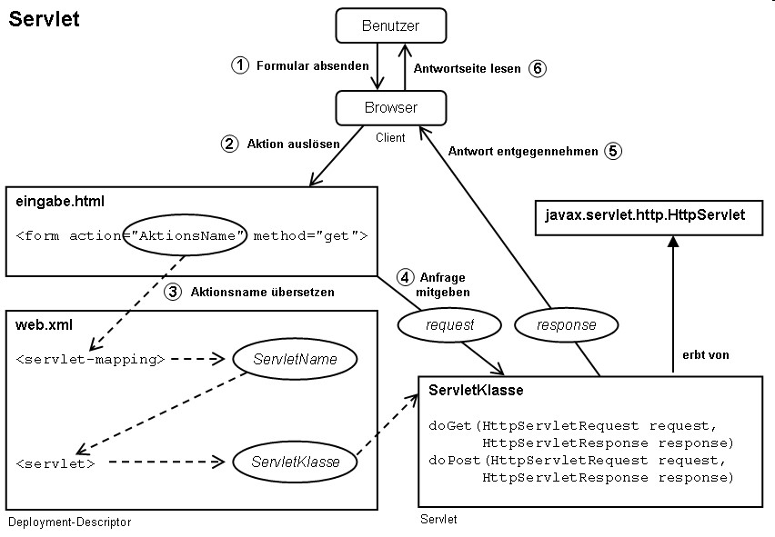
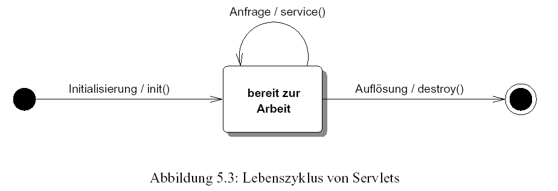
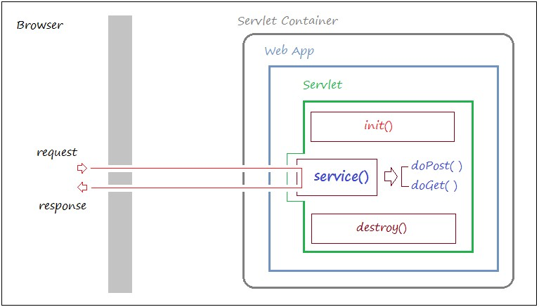
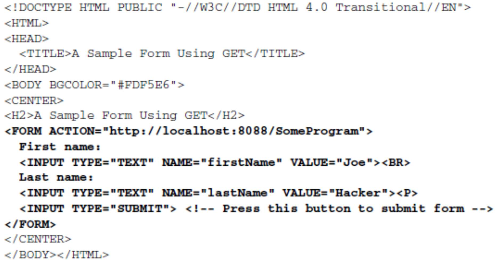
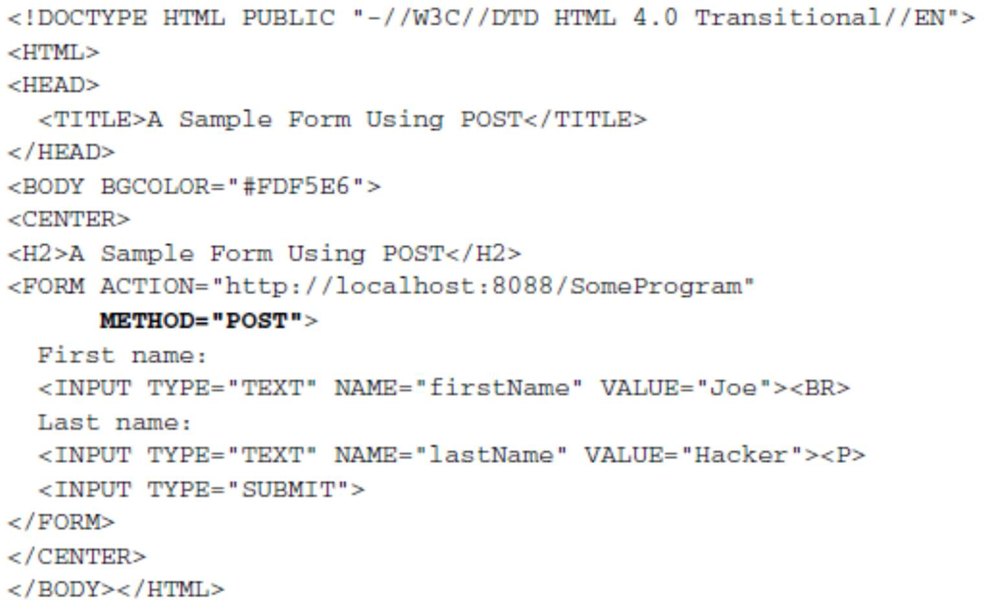

# Servlets: Grundstruktur und DB-Anbindung

## Kommunikationsablauf bei Java Servlets (Reihenfolge, beteiligte Klassen mit Funktionen, beteiligte „Dateitypen“ mit Beschreibung)



## Lebenszyklus eines Java Servlets




Der Lebenszyklus eines Servlets im Detail:

* Laden und instanziieren
    * Entweder beim Start des Servlet‐Containers oder bei der ersten Anfrage
* Initialisieren
    * Die `init`‐Methode des Servlets wird aufgerufen
    * Hier kann das Servlet Initialisierungsaufgaben erledigen, z.B. eine Datenbankverbindung herstellen oder Konfigurationsdaten aus einer Datei oder aus dem Deployment Descriptor (web.xml) einlesen
* Client‐Anfragen bearbeiten
    * Die `service`‐Methode des Servlets wird aufgerufen (Soll nicht überschrieben werden)
    * Diese Methode überprüft den HTTP‐Anfragetyp und leitet die Anfrage an die richtige Methode weiter, zB. `doGet`, `doPost`
* Servlet‐Klasse wieder entladen
    * Der Servlet Container entscheidet, wann die Servlet‐Instanz wieder aus dem Speicher entfernt wird
    * Vorher wird die Methode `destroy` aufgerufen

Quelle: [Webanwendungen_Java_Einfuehrung (S. 43-45)](../archiv/insy-game/jahrgang5/Webanwendungen_Java_Einfuehrung.pdf)

## Was ist ein Deployment Descriptor? Wie wird er verwendet?

* Die Struktur jeder Webapplikation wird mit Hilfe der XML‐Datei web.xml beschrieben.
* Zwei wichtige Elemente beim Arbeiten mit Servlets sind
    * `servlet`
    * `servlet-mapping`
* Namen `web.xml` tragen und sich im Unterverzeichnis `WEB-INF` zum Wurzelverzeichnis der Webanwendung befinden
* Beispiel (Auszug aus der `web.xml`):

```
<servlet>
    <servlet‐name>MyName</servlet‐name>
    <servlet‐class>myPackage.MyServlet</servlet‐class>
</servlet>

<servlet‐mapping>
    <servlet‐name>MyName</servlet‐name>
    <url‐pattern>/MyAddress</url‐pattern>
</servlet‐mapping>
```

Quelle:
* [Webanwendungen_Java_Einfuehrung (S. 24-25)](../archiv/insy-game/jahrgang5/Webanwendungen_Java_Einfuehrung.pdf)
* [https://de.wikipedia.org/wiki/Deployment_Descriptor](https://de.wikipedia.org/wiki/Deployment_Descriptor)

## Kann der Deployment Descriptor ersetzt werden?

* Die Adresse mit `@WebServlet` festlegen
* Beispiel:

```java
@WebServlet("/my‐address")
@WebServlet(name="HelloHTLServlet", urlPatterns = "/HelloHTLServlet")
public class MyServlet extends HttpServlet { 
    ...
}
```

Quelle: [Webanwendungen_Java_Einfuehrung (S. 26)](../archiv/insy-game/jahrgang5/Webanwendungen_Java_Einfuehrung.pdf)

## Wie kann ich die Bearbeitung auf mehrere Servlets aufteilen?


## Wie verarbeite ich Benutzereingaben in einer HTML-Seite?

| GET-Formular         | POST-Formular         |
|----------------------|-----------------------|
|  |  |

* `request.getParameter("name")`
    * Rückgabe:
        * URL Wert des ersten Auftretens zurück
        * `null` wenn der Parameter nicht existiert
    * gleich für GET und POST requests
* `request.getParameterValues("name")`
    * Rückgabe:
        * Ein Array der URL-kodierten Werte bei allen Auftreten von name
        * `null` wenn der Parameter nicht existiert
* `request.getParameterNames()` oder `request.getParameterMap()`
    * Rückgabe: Enumeration oder Map der Request-Parameter

Quelle: [Webanwendungen_Java_Eingaben_Forms (S. 10)](../archiv/insy-game/jahrgang5/Webanwendungen_Java_Eingaben_Forms.pdf)

## Welche Konsequenzen hat die Multithreading-Eigenschaft eines Servlets (wer kümmert sich um die Ressourcen, start/stop des Threads)?


## Was versteht man unter einem „Redirect“? Wie kann dies via Servlets realisiert werden und wozu setzt man dies ein?

* Als Redirect oder Weiterleitung (Kurzform für “redirection”) wird eine server- oder clientseitige und automatische Umleitung einer URL zu einer anderen URL bezeichnet.
* Weiterleitungen werden für verschiedene Zwecke wie dem Umzug einer Website auf eine neue Domain oder Serverwartungen verwendet.
* Einsatzgebiet:
    * Nach dem Login zur internen Seite
    * Unberechtigter Zugriff -> Weiterleitung zu Login
* Beispiel:

```java
@WebServlet("/wrong-destination")
public class WrongDestination extends HttpServlet {
    
    public void doGet(HttpServletRequest request, HttpServletResponse response) throws ServletException, IOException {
        String userAgent = request.getHeader("User-Agent");
        
        if ((userAgent != null) && (userAgent.contains("MSIE")) {
            response.sendRedirect("http://home.mozilla.com");
        } else {
            response.sendRedirect("http://www.microsoft.com");
        }
    }
}
```

Quelle:
* [Webanwendungen_Java_Eingaben_Forms (S. 7-8)](../archiv/insy-game/jahrgang5/Webanwendungen_Java_Sessions.pdf)
* [https://de.ryte.com/wiki/Redirect](https://de.ryte.com/wiki/Redirect)

## Wie kann ein Servlet parametrisiert werden und wie werden Ressourcen (z.B. DB-Connection) angefordert bzw. wieder frei gegeben.


## Wie können Annotations eingesetzt werden (Beispiel)?


## Wozu braucht man bei Servlets einen Kontext?

* Ermöglicht Servlets, die zu derselben Anwendung gehören, die gemeinsame Nutzung von Daten und die Kommunikation
    * Kann zum Beispiel verwendet werden, um Details für eine JDBC-Verbindung zu speichern (Details, die von verschiedenen Servlets geteilt werden)
* Ermöglicht das Setzen und Abrufen von Attributen
* Stellt Informationen über den Server bereit
    * Kann zum Schreiben von Nachrichten in eine Protokolldatei verwendet werden
    * `getServletContext().getAttribute()`
    * `getServletContext().setAttribute()`

| Art der Variable               | Sichtbarkeit                                                   | Lebensdauer                          |
|--------------------------------|----------------------------------------------------------------|--------------------------------------|
| Attribute eines ServletContext | Alle Servlets im ServletContext                                | Bis zum Ende der WebApplikation      |
| Attribute einer Session        | Servlets im ServletContext, die Requests der Session behandeln | Bis zum Ablauf der Session           |
| Instanzvariablen eines Servlet | Methoden des Servlet                                           | Servlet.init() bis Servlet.destroy() |
| Attribute eines ServletRequest | Servlets, die den Request behandeln                            | Bis zum Ende der Request-Behandlung  |

Quelle: [Webanwendungen_Java_Eingaben_Forms (S. 26-27)](../archiv/insy-game/jahrgang5/Webanwendungen_Java_Sessions.pdf)

## Wodurch unterscheidet sich ein Servlet und ein normales Java-Programm?

* Java‐Programme, die auf einem Web‐ oder Anwendungsserver ausgeführt werden.
* dienen der dynamischen Generierung von Webseiten / Webcontent (Basis für alle Java Server Frameworks)
* plattformunabhängig durch Verwendung der Java‐Technologie
* prinzipiell protokollunabhängig, werden allerdings meistens im Zusammenhang mit HTTP verwendet

Quelle: [Webanwendungen_Java_Einfuehrung (S. 10)](../archiv/insy-game/jahrgang5/Webanwendungen_Java_Einfuehrung.pdf)

## Aufbau einer URL für den Aufruf eines Servlets (Beispiel).


Quelle: [Webanwendungen_Java_Einfuehrung (S. 26)](../archiv/insy-game/jahrgang5/Webanwendungen_Java_Einfuehrung.pdf)

## Vorteile\Nachteile von Servlets gegeüber anderen Web-Frameworks?

* Vorteile:
    * Portabel und Plattformunabhängig
    * Einsatz der Möglichkeiten einer objektorientierten Programmiersprache 
    * Skalierbarkeit durch Verteilte Systeme
* Nachteile:
    * Trennung von Programmlogik und Visualisierung nicht vorhanden
    * Serverseitige Verarbeitung (Vgl. JavaScript -> Vue3 -> Clientseitig)

Quelle: [https://www.itwissen.info/Servlet-servlet.html](https://www.itwissen.info/Servlet-servlet.html)