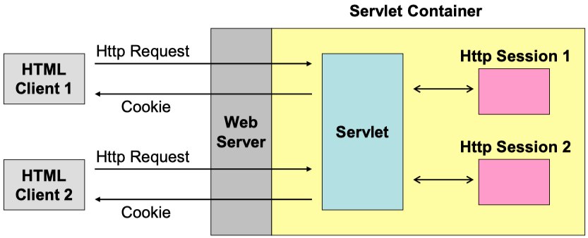
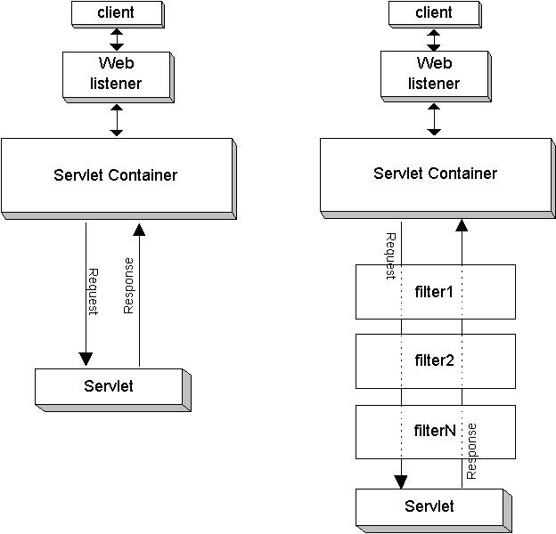
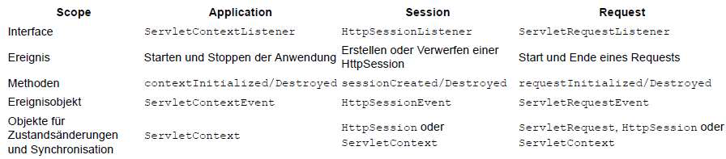

# Servlets: Session Tracking und DB-Anbindung

## Session Tracking



Quelle: [Webanwendungen_Java_Sessions (S. 12)](../archiv/insy-game/jahrgang5/Webanwendungen_Java_Sessions.pdf)

## Servlet API und Session Tracking

* Servlets enthalten eine integrierte Sitzungs-API
    * Sitzungen werden automatisch aufrechterhalten, ohne zusätzliche Codierung.
    * Der Webcontainer ordnet ein eindeutiges `HttpSession`-Objekt für jeden anderen Client zu.
    * Unterschiedliche Clients haben unterschiedliche Sitzungsobjekte an der Server.
    * Anfragen von demselben Client haben dieselbe Sitzung Objekt.
    * Sitzungen können verschiedene Daten speichern.
* Die Sitzungs-API ermöglicht
    * das `HttpSession`-Objekt aus dem HTTPServletRequest-Objekt zu erhalten
    * Daten aus dem Sitzungsobjekt des Benutzers zu extrahieren
    * Daten an das Sitzungsobjekt des Benutzers anzuhängen
    * Meta-Informationen über das Sitzungsobjekt zu extrahieren
        * z.B. Wann wurde die Sitzung erstellt
* Abrufen des Sitzungsobjekts: `HttpSession session = request.getSession();`
    * Wenn der Benutzer bereits eine Sitzung hat, wird die vorhandene Sitzung zurückgegeben.
    * Wenn noch keine Sitzung besteht, wird eine neue erstellt und zurückgegeben.
    * Wenn man wissen möchte, ob dies eine neue Session ist: `isNew()`

Quelle: [Webanwendungen_Java_Sessions (S. 13-15)](../archiv/insy-game/jahrgang5/Webanwendungen_Java_Sessions.pdf)

## Überblick Session

* Eine Sitzung ist ein Zustand, der einem bestimmten Benutzer zugeordnet ist und auf der Serverseite aufrechterhalten wird.
* Sitzungen zwischen den HTTP-Anfragen
* Sitzungen ermöglichen das Erstellen von Anwendungen, die von abhängen individuelle Benutzerdaten.

Quelle: [Webanwendungen_Java_Sessions (S. 11)](../archiv/insy-game/jahrgang5/Webanwendungen_Java_Sessions.pdf)

## Variablen (implizite Objekte)

* request
    * Informationen über die vom Client gestellten Anfragen
* response
    * Informationen der Antwort an den Client
* pageContext
    * ermöglicht den Zugriff auf die verschiedenen Gültigkeitsbereiche (scopes)
    * Ausserdem bietet es Methoden an, Informationen über die Servlet-Umgebung bzw. den verwendeten Server auszulesen
* session
    * Informationen über Session auslesen
* application
    * Zugriff/Auslesen auf Ressourcen (zB. Servlet-Container oder Version der Servlet-API)
* out
    * Direkte Ausgaben an den Client
* config
    * Auslesen von Konfigurations-Parameter des Servlets
* page
    * Referenz auf das Servlet-Objekt, welches die Abfrage beantwortet
* exception
    * Für spezielle Fehlerbehandlung

Quelle: [https://homepages.thm.de/~hg10013/Lehre/MMS/SS01_WS0102/JSP/implizitobj.html](https://homepages.thm.de/~hg10013/Lehre/MMS/SS01_WS0102/JSP/implizitobj.html)

## Request Dispatcher, Methoden, Redirect, Synchronisieren oder nicht?

* Weiterleiten der Anfrage an eine andere Ressource
    * `forward` – Die Kontrolle wird vollständig an ein anderes Servlet abgegeben (Es dürfen noch keine Daten gesendet worden sein)
    * `include` – Lediglich das Resultat eines weiteren Servlets wird eingebettet ("wrapping")
* Vergleich Redirect: Beim Redirect wird eine neue Anfrage gestellt -> Request und Response gehen dabei verloren

| `forward`-Methode                                     | `include`-Methode                                     |
|-------------------------------------------------------|-------------------------------------------------------|
|  |  |


Quelle:
* [Webanwendungen_Java_Sessions (S. 11)](../archiv/insy-game/jahrgang5/Webanwendungen_Java_Sessions.pdf)
* [https://www.javatpoint.com/requestdispatcher-in-servlet](https://www.javatpoint.com/requestdispatcher-in-servlet)

## Cookies: Definition, Eigenschaften, Lebensdauer, Erzeugen, Löschen, Sicherheit

* Definition
    * Textfile, welches vom Browser gespeichert wird
* Eigenschaften
    * Key-Value-Paare
* Lebensdauer
    * Standardgemäß: Cookielebensdauer = Sessiondauer
    * Optional: veränderbar
* Erzeugen, Löschen
    * Cookie kann durch Webanwendung erstellt, bearbeitet und gelöscht werden
* Sicherheit
    * Cookies werden standardgemäß unverschlüsselt abgespeichert
    * Webseiten können ein Cookie schützen, indem Sie verschlüsselt werden, und so nicht mehr augelesen werden können
* Verwendung:
    * Speichern der SessionID, nach dem erfolgreichen Login bei Webseiten
    * Warenkorb bei Webshops
    * Personalisierung (Seiteneinstellungen, ...)
    * Tracking, Werbung
    * ...

Beispiel:

```java
// Erzeugen eines Cookie Objekts.
Cookie c = new Cookie("userID", "a1234");

// Die maximale Lebensdauer festlegen
// Cookie wird dann auf Platte gespeichert.
c.setMaxAge(60*60*24*7); // 1 Woche
// Wenn nicht gesetzt, dann Lebensdauer = Sessiondauer

// Cookie an den Browser schicken
response.addCookie(c);

// Löschen eines Cookies
c.setMaxAge(0);
```

```java
// Cookie auslesen
String cookieName = "userID";
Cookie[] cookies = request.getCookies());

if (cookies != null) {
    for (Cookie cookie : cookies) {
        if (cookieName.equals(cookie.getName())) {
            doSomethingWith(cookie.getValue());
        }
    }
}
```

Quelle:
* [https://www.verbraucherzentrale.de/wissen/digitale-welt/datenschutz/cookies-kontrollieren-und-verwalten-11996](https://www.verbraucherzentrale.de/wissen/digitale-welt/datenschutz/cookies-kontrollieren-und-verwalten-11996)
* [Webanwendungen_Java_Sessions (S. 6-7)](../archiv/insy-game/jahrgang5/Webanwendungen_Java_Sessions.pdf)

## Was sind Filter und wie verwendet man sie?



* Filter filtert einfach die Antwort und Anfrage
* Servlet-Filter wird verwendet, um Anfrage und Antwort vom Client an das Servlet zu überwachen oder um die Anfrage und Antwort zu ändern
* Einsatzgebiete:
    * Protokollierung von Request-Parameter
    * Authentifizierung und Rechte bei Zugriff auf Ressourcen
    * Formatierung Request
    * Response Erweiterung durch Cookies, Header Information etc.
    * Implementiert Filter Interface

Beispiel:

```java
@WebFilter("/AuthenticationFilter")
```

```
<filter>
    <filter-name>AuthenticationFilter</filter-name>
    <filter-class>com.filters.AuthenticationFilter</filter-class>
</filter>

<filter-mapping>
    <filter-name>AuthenticationFilter</filter-name>
    <url-pattern>/*</url-pattern>
</filter-mapping>
```

```java
public void doFilter(ServletRequest request, ServletResponse response, FilterChain chain) throws IOException, ServletException {
    ...

    if (session == null && !(uri.endsWith("html") || uri.endsWith("Login") || uri.endsWith("Register"))) {
        logger.error("Unauthorized access request");
        res.sendRedirect("login.html");
    } else {
        // pass the request along the filter chain
        chain.doFilter(request, response);
    }

    ...
}
```

Quelle: [Webanwendungen_Java_Sessions_Vertiefung (S. 14-16)](../archiv/insy-game/jahrgang5/Webanwendungen_Java_Sessions_Vertiefung.pdf)

## Was sind Listener und wie verwendet man sie?

* Werden bei Lifecycle Ereignissen (Event Listening) der Webanwendung vom Container gerufen
    * Sind eine Art Trigger.
    * im Deployment Descriptor (DD) der Anwendung dem Container bekannt gemacht.
    * Listener werden pro Anwendung einmal in der
    * Reihenfolge ihres Erscheinens im DD instanziiert.
    * Sie sind Application-Singletons.



Quelle: [Webanwendungen_Java_Sessions_Vertiefung (S. 8-9)](../archiv/insy-game/jahrgang5/Webanwendungen_Java_Sessions_Vertiefung.pdf)

## Wie realisiert man eine Datenbankanbindung mit Servlets?


## Was kann man dabei optimieren (Anzahl der DB-Connections)?

