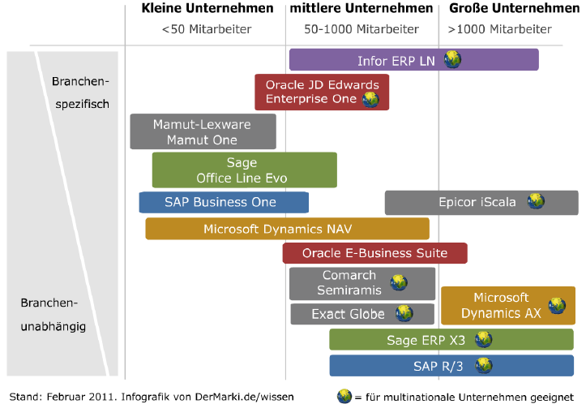

# 11.1. ERP-Systeme

## Was ist ein ERP-System
* Enterprise Resource Planning steuert die im Unternehmen vorhandenen Ressourcen (z.B.: Kapital, Mitarbeieter, Betriebsmittel)
* Organisation aller administrativen, dispositiven und kontrollierenden Tätigkeiten
* Früher wurden für alle Abteilungen eigene Programme erstellt
* Somit konnten Geschäftsprozesse schwer verfolgt und angepasst werden
* Ein ERP-System geht über alle Organisationseinheiten wie Einkauf Produktion, Kostenrechnung, Entwicklung usw.
* Benötigt Datenbank
* Ziele
	* Verbesserung der organisatorischen Abläufe und Strukturen
	* Schnellere Anpassungsfähigkeit an Unternehmens- und Marktveränderungen
	* Optimierung der Geschäftsprozesse

## Funktionsbereiche
* Vertrieb und Marketing
* Materialwirtschaft
* Produktion
* Bedarfsermittlung
* Finanz- und Rechnungswesen
* Controlling
* Personalwirtschart
* Forschung und Entwicklung
* Stammdatenverwaltung
* Produktdatenmanagement
* Dokumentenmanagement

## Allgemeine Vorteile & Nachteile
* Vorteile
	* Erhöhte Automatisierung für kürzere Bearbeitungszeiten undKostenersparnisse
	* Erhöhte Datenqualität, Redundanzen und Inkonsistenzen werden vermieden
	* Verbesserte Zusammenarbeit über Abteilungsgrenzen hinweg
	* Optimierter Informationsfluss im Unternehmen
	* Überwinden organisatorischer und technischer Schnittstellen

* Nachteile
	* Hoher Aufwand bei der Einführung mit hohem Kostenaufwand.
	* Abhängigkeit vom Hersteller.
	* Demotivation der Mitarbeiter bei komplizierten, nutzerunfreundlichenSystemen.
	* Hoher Aufwand für Customizing, Schulung und Wartung.
	* Hoher Aufwand für die Integration von Fremdsystemen.
	* Kommt Mist rein, kommt Mist raus. Nur saubere Daten garantieren saubere und das heißt aussagefähige Ergebnisse.

## Anforderungen an ein ERP System
* Abdeckung der wesentlichen betriebswirtschaftlichen Funktionalitäten
* Hohe Modularität bei gleichzeitiger Integration der Module untereinander
* Unterstützung internationaler Anforderungen
	*Mehrsprachigkeit
	*Unicode-Fähigkeit (Darstellung asiatischer Schriften)
	*Landesspezifische Funktionalitäten
* Lauffähigkeit auf verschiedenen Rechner- und Betriebssystem Plattformen
* Skalierbarkeit von kleinen Anwendungs-Szenarien auf große und sehr große Szenarien zu skalieren
* Portabilität auf allen wesentlichen Betriebssystemen und HW-Plattformen einsetzbar
* Offenheit durch standardisierte Schnittstellen die Integration mit anderen SWSystemen
* Grafische Bedieneroberfläche

## Marktführer: SAP, Microsoft Dynamic Navition, Oracle
* Marktsegmentierung

* Marktanteile
* Anbieter Umsatz 2006 (Mio $) Umsatz 2007  (Mio $) Marktanteil 2008 (%)
* 1 SAP 5.730,1 5.732,3 26,8
* 2 Oracle 2.608,3 2.718,9 12,7
* 3 Sage 1.459,5 1.695,7 7,9
* 4 Infor 1.239,6 1.312,6 6,1
* 5 Microsoft 778,9 795,9 3,7
* 6 IFS 260 270 3,1
* 7 Agresso 160 199 2,2

## Arten (On Premise, Cloud, Mobile (Echtzeitdaten), Social, usw.) + Vor- & Nachteile

### On Premise
* Vorgänge und Geschäftsprozesse integriert, von
	* Vertrieb und Kundenmanagement
	* bis hin zum Controlling,
	* Rechnungswesen und
	* Lohnbuchhaltung
* Vorteile
	* Geringer Aufwand
	* Schlüsselfertig
	* Einfach bedienbar
* Nachteile
	* Schwer individuell anpassbar bei vielen Updates
	* Längerer Implementierungsprozess
	* Mehr Kosten zu Beginn
	* IT-Abteilung und hardware notwendig
	
### Cloud
* Software-as-a-Service-Lösung
* Fertig entwickeltes ERP-Softwarepaket online
* Vorteile
	* Kalkulierbare Kosten
	* Hohe Datensicherheit
	* Keine eigene IT-Abteilung notwendig
* Nachteile
	* Mehr Kosten auf lange Dauer
	* Datensicherheit ist von dem Anbieter abhängig
	* Weniger anpassbar
	
### Mobile
* ERP auf eigenen Laptops & Smartphones über Cloud
* Vorteile:
	* Flexibler
	* Individueller
	* Effizienter
	
### Social ERP
* Informationen zentral bereitgestellt
* Informationen überall und immer verteilbar
* Personenbezogene Daten für Werbekampagnen

## Historische Entwicklung

## SAP-Hana
* 2010
* High Performance Analytic Appliance
* für das Big Data Umfeld geeignet
* sämtliche Daten im Arbeitsspeicher vorgehalten, die Datenbank ist damit zu extrem leistungsfähigen Analysen und Berechnungen imstande
* Daten können in relationaler DB vorliegen
* Vorteile
	* Schneller lesender Zugriff durch In-Memory-Technologie
	* Schneller schreibender Zugriff durch Zeilenorientierung
	* Geeignet für Big Data Lösungen
	* Möglichkeit zur Nutzung komplexer Algorithmen, auch geeignet für Vorhersagemodelle
	* SAP HANA ist SQL-kompatibel und kann auch von NON-SAP-Anwendungen genutzt werden
	* Bringt eine eigene Entwicklungsumgebung mit
* Nachteile
	* Bei einem Systemausfall gehen die Daten des Arbeitsspeichers verloren und sind ggf. zu diesem Zeitpunkt noch nicht gesichert worden
	* Es wird vergleichsweise teure Hardware benötigt

## OpenSource ERP-Systeme
* Warum haben sie nicht funkioniert?
	* hohe Komplexität von ERP-Systemen
	* fehlender Unterstützung bei Prozessoptimierung
	* fehlendem Support
	* sehr hohem Anpassungsbedarf
	* hohe Anpassungskosten
* Nicht durchgesetzt

## Kriterien
* Unternehmen muss wissen was es will
* Aktueller Standpunkt der Firma (Branche, Mitarbeiteranzahl, Standorte, Gründe für Einsatz, usw.)
* EDV-Infrastruktur (HW, Netzwerk, OS, usw.)
* Ziele der Software-Einführung
* Rahmenplanung (Zeitplanung, Kostenplanung)
* Softwarelizenzen
* IT-Struktur
* Anbieterleistungen
* Funktionalitäten für die einzelnen Abteilungen

## Systemlandschaften
* Große Organisationen betreiben in der Regel mehrere produktive SAPSysteme.
* Die Siemens AG bspw. betreibt ca. 200 produktive SAP-Systeme.
* Derzeit besteht ein Trend in der Industrie, die Anzahl der Systeme zu reduzieren. Dies wird als SAP-Systemkonsolidierung bezeichnet.
* Produktivsystem (P-System) 
* Qualitätssicherungssystem (Q-System) (Fachlich)
* Entwicklungssystem (E-System) (Technisch)
