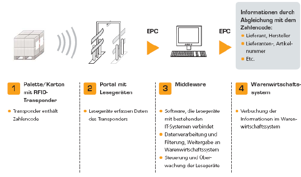
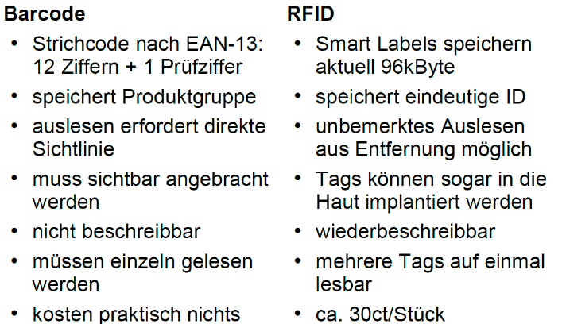

# 11.3. EAN, RFID, QR-Code

## QR-Code
* Quick Response
* Stellt Daten binär dar
* Enthalten:
	* Versionsinformation
	* Datenformat
	* Datenteil
	* In 3 Ecken ein bestimmtes Muster

* Lesen
	* Erzeugen eines digitalen Bildes der QR-codierten Daten, z. B. mit Hilfe einer Digitalkamera.
    * Umwandeln der im Bild enthaltenen codierten Daten in Textform (Dekodieren).

* Generierung
	* den Text, der codiert werden soll
    * den gewünschten Grad der Fehlerkorrektur

* Anwendungsfälle
	* Fahrplanauskunft und Navigationshilfe
	* Werbung
	* Digitalisierung des Zahlungsverkehrs
	* Umfragen
	* usw. 

## RFID
* Radio Frequency Identification
* besteht aus einer Sende-Empfangs-Einheit (Lesegerät) und einem Transponder, auch RFID-Tag genannt
* Daten werden per Funk ausgelesen
* Tag speichert den Electronic Product Code EPC

* Bauformen:
	* Zylinder
	* Glas
	* Disks, Münzen
	* Wedge
	* Smart LAbel

* Passiv
	* geringe Reichweite
	* preiswerte Herstellung, klein
	* praktisch unbegrenzte Lebensdauer

* Aktiv
	* hohe Reichweite
	* aufwändige Herstellung
	* benötigen Energiequelle z.B. Batterie oder Fahrzeug-Bordnetz

* Funktionsweise

* Reichweiten
	* Close Coupling (0-1cm) (Sicherheitskritische Anwendungen)
	* Remote Coupling (< 1m) (Supermarkt, Zutrittskontrolle)
	* Long Range (< 10m) (Flottenmanagement)

* Vorteile
	* Kontaktlose Identifikation ohne Sichtverbindung
		* Erfassung innerhalb von Verpackungen
		* Keine Positionierung zum Lesegerät erforderlich
		* Bei Schmutz und ungünstigen Lichtverhältnissen
	* Pulkerfassung(gleichzeitige Erfassung mehrerer Transponder)
	* Erkennung bei Bewegung
	* Nahezu fehlerfreie Identifikation
	* GroßesSpeichervolumen

* Anwendungsfälle
	* Produkte im Supermarkt 
	* Smart Shelf im Supermarkt (Regal mit RFID-Lesegeraten)
	* Löst Bar-Code ab
	* Reisepass
	* Inventur
	* Vereinfachtes kassieren
	* Wareneingangsmanagement
	* Wareneingangsplanung
	* WA & -kontrolle, Einlagerung & EB
	* Warenannahme und -kontrolle
	* Lagermanagement

* Vergleich mit Bar-Code

* Sicherheitsbedenken
	* Passive RFID-Tags sind nach Kostengesichtspunkten entworfen → keine/kaum Sicherheitsfeatures
	* Sniffing
		* Kommunikation zwischen Tag und Leser abhören
	* Spoofing und Replay-Attacken
		* laufende Kommunikation manipulieren oder später wieder einspielen
	* Man-in-the-Middle-Attacken
		* Angreifer schaltet sich in die Kommunikation ein
	* Cloning, Emulation
		* fremden Transponder nachbauen bzw. emulieren
	* DenialofService
		* RFID-Chip beschädigen, Lesefeld stören (jamming)
	* Tracking
		* Bewegungsprofile durch Zuordnung der eindeutigen RFID-ID und Zeitpunkt der Lesung
	* Relay-Angriffe
		* durch spezielle Antennen/elektronische Verstärkung Lesereichweite erhöhen, z.B. Anwesenheit einer Schlüsselkarte aus der Entfernung vortäuschen
	* Einziger Schutz bisher: beschränkte Reichweite

## EAN/Strichcode
* European Article Number
* 1-2 Herstellerland (90 & 91 für Österreich)
* 3-7 Produkthersteller
* 9-12 Artikelnummer
* 13 Prüfziffer

* Vorteile
	* schnellere Registrierungder Waren an der Kasse (weniger Wartezeit an der Kasse)
	* höhere Sicherheit (weniger Tippfehler oder Irrtümer)
	* Erleichterung des Warenverkehrs, automatisierbare Lagerhaltung
	* kein Preisetikettan der Ware nötig, Preis muss nur am Regal stehen (was für den Kunden mangels Überprüfbarkeit an der Kasse eher ein Nachteil ist)
	* transparente, weltweite Standardisierung (zzt.90% aller Waren)

* Nachteile
	* Einzelpreisauszeichnung verloren gegangen (Preis an dem Produkt) => Für Kunde verwirrend
	
* Andere Produktkennzeichen
	* ISBN, ISMN, ISRC, ISSN, PZN
