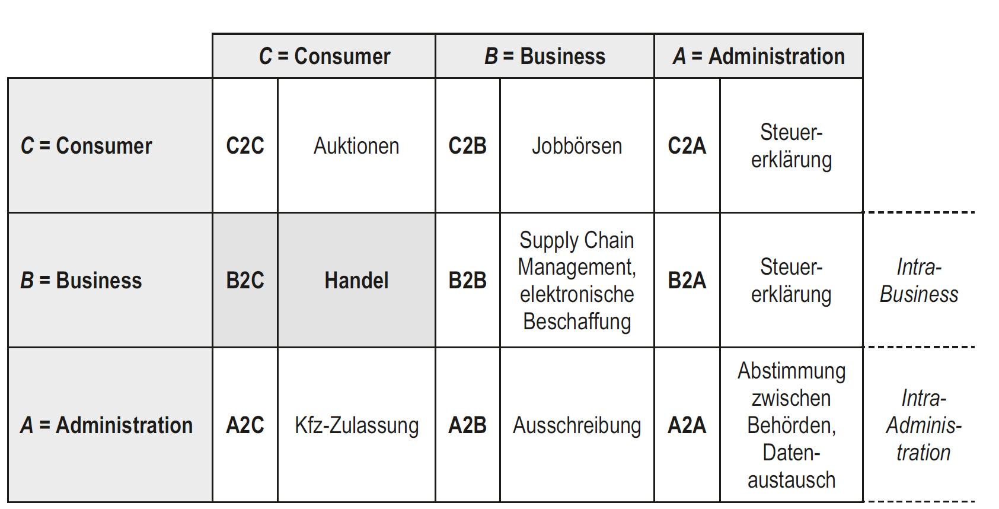
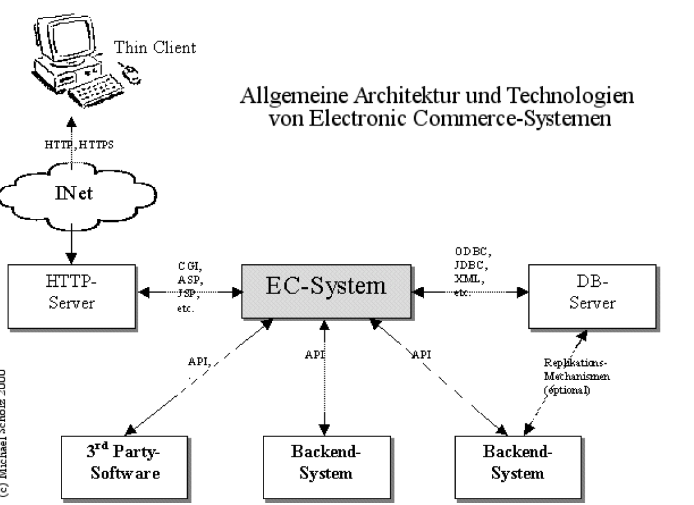

# 12.1 eBusiness (eCommerce, Portaltechnologie, …)

* E-Business (Electronic Business) ist die Durchführung von Online-Geschäftsprozessen im Web, Internet, Extranet oder einer Kombination davon. 
* Diese kunden-, internen und managementorientierten Geschäftsprozesse umfassen 
	* den Kauf und Verkauf von Waren und Dienstleistungen, 
	* die Betreuung von Kunden, 
	* die Verarbeitung von Zahlungen, 
	* die Verwaltung von Produktions- und Lieferketten, 
	* die Zusammenarbeit mit Geschäftspartnern, 
	* den Austausch von Informationen, 
	* die Durchführung automatisierter Mitarbeiterdienste und 
	* die Rekrutierung von Mitarbeitern.

## Allgemeines
* e-Business: Geschäftsprozesse inner-und außerhalb des Unternehmens (Business-to-Business => B2B). Begriff ursprünglich im Jahre 1998 von IBM geprägt
* e-Commerce: kommerzielle Aktivitäten zwischen den Marktteilnehmern (Business-to-Consumer  => B2C, Consumer-to-Consumer => C2C)
* e-Government: Integration von Beziehungen natürlicher/juristischer Personen und Institutionen der öffentlichen Hand mittels IT (Business-to-Administration => B2A, Administration-to-Customer => A2C)

## Akteure & Geschäftsmodelle
* Consumer
* Business
* Administration

## Marktmodelle
* Horizontale (branchenübergreifende)
* Vertikale (branchenspezifische)
* Offene (für alle Teilnehmer frei zugänglich)
* Geschlossene (schränken die Zahl der Teilnehmer aus unternehmenspolitischen Gründen ein)

## Portaltechnologie
* zentralen Einstiegs-und Navigationspunkt, der dem Anwender Zugang zu einem virtuellen Angebotsraum bietet und ihn auf weiterführende Informationen leitet
* Horizontale (viele Themen, aber nicht detailliert)
* Vertikale (ein Thema, aber detailliert)

### Eigenschaften
* Personalisierung
* Suchfunktionen und Navigation
* Push-Technologie
* Kollaborations-und Groupwarekomponenten (ermöglichen den Beschäftigten, sich untereinander oder mit Lieferanten und Kunden abzustimmen und auszutauschen)
* Workflowkomponenten (Dadurch werden Abläufe zwischen Geschäftspartnern und dem Unternehmen bzw. innerhalb des Unternehmens automatisiert)
* Integration der Anwendungen
* Integration von Informationsquellen
* Benutzerverwaltung und Sicherheitssysteme

### Anbieter
* IBM (WebSpherePortal Server)
* Microsoft Office SharePoint Server
* SAP (SAP NetWeaverPortal)

## Softwarekomponenten
* Frontend
* Backend (mit Anbindung zur DB)
* Analysentools
* Schnittstellen zu Banken und anderen Zahlungssystemen

## Architekturen

## Shopsysteme
* X-Commerce
* Shopify
* OS-Commerce
* Wixx
* Amazon
* Wordpress mit Addons

## Mikropayments
* Micropayments sind kleine Transaktionen oder Zahlungen von in der Regel weniger als einem Dollar - und in einigen Fällen nur einen Bruchteil eines Cents -, die hauptsächlich online getätigt werden. 
* Micropayments werden als eine Möglichkeit gesehen, das Internet zu nutzen, um die sofortige Verteilung von digitalen Rechten, Lizenzgebühren, In-Game-Käufen, Online-Trinkgeldern und sogar zur Koordinierung von Geräten, die über das Internet der Dinge (IoT) verbunden sind, zu erleichtern.
