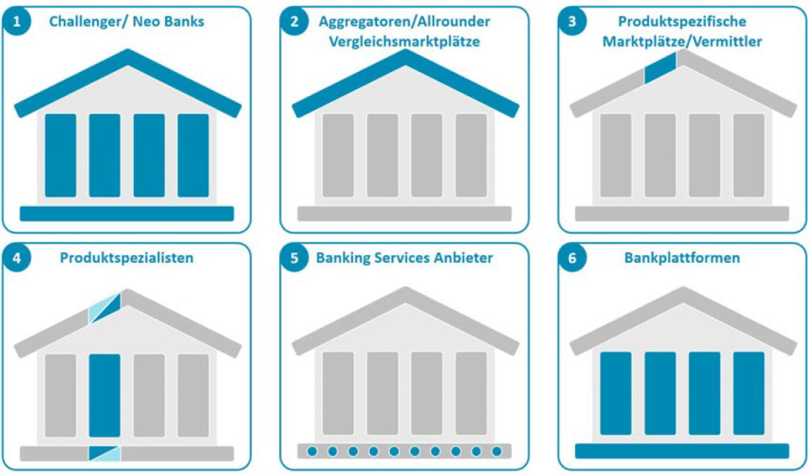
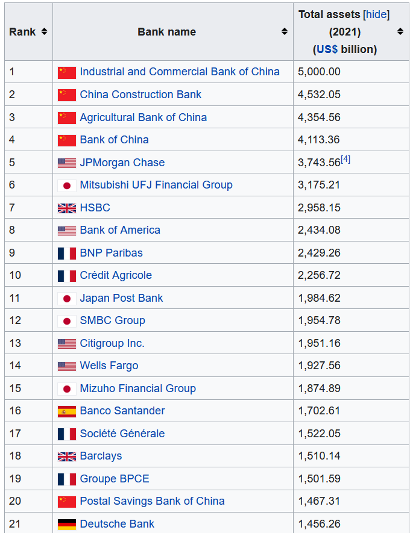

# 12.2 IT im Dienstleistungsunternehmen (Banken, Versicherungen, Tourismus)

## Dienstleistungsbranche
* Banken
* Versicherungen
* Tourismus
* Bildungswesen
* Gesundheitswesen

## Banken
* IT-Systeme
	* Wertpapiere
	* Kredite
	* Fremdwährungen
	* Automaten
	* Bargeld
	* OnlineBanking
	* Front-/Backoffice

* Raiffeisen, Sparkassensektor, Volksbanken mit Softwaresystemen (ELBA, George)
* Zahlungssysteme
	* Ripple,
	* XAP,
	* Swift-Systeme

* Flexcube (Bankingsoftware von Oracle)
* Früher alle eigene Lösungen, heute Standardlösungen
* Weil viel Online erledigt wird, werden Banken zusammengelegt => Verringerung der Standorte
* CBDC
	* Central bank digital currencies
	* digitale Token, ähnlich wie Kryptowährungen, die von einer Zentralbank ausgegeben werden. 
	* Sie sind an den Wert der Fiat-Währung (z.B. Euro) dieses Landes gebunden.

* Fintechs
	* setzt sich aus den Anfangssilben von Finanzdienstleistungen und Technologie zusammen. 
	* Mit Fintech wird die Branche bezeichnet, in der Finanzdienstleistungen mit Technologie verändert werden. 
	* Archetypen von Fintechs:
	

	
	* Bsps.:
		* N26
		* Check24
		* Klarna
		* solarisBank
		
	* N26:
		* Auf OnlineBanking spezialisiert
		* Keine Gebühren auf Auslandszahlungen
	
* DEFI
	* Dezentralisierte Währung (z.B. Kryptowährungen)
	* Keine Banken
	* Ohne Mittelsmann
	* (So wenig wie möglich) keine Überwachung bei Zahlungen

### Größte Banken (weltweit)
* Erste 4 Chinesisch

## Versicherung

* IT-Systeme
	* Angebots-/Kundensoftware
	* Polizenmanagement
	* Abbuchungssoftware
	* Reiseversicherungen

* Österreichische Versicherungen
	* Allianz, 
	* Unica, 
	* Generali (Ex-Vatikan), 
	* Vienna Städtische, 
	* Donau

* Klassifikationen von Versicherungen
	* Individual-und Sozialversicherung
	* Personen-und Nichtpersonenversicherungen
	* Schadens-und Summenversicherungen
	* Aktiven-und Passivenversicherungen
	* Nach der Art des versicherten Risikos
	
### Rückversicherung
* Diese Versicherungsform wird abgeschlossen zur Deckung von Einzelrisiken bzw. ganzen Portfolios (Vielzahl von Einzelrisiken mit gemeinsamen Merkmalen). 
* Die Versicherung der Versicherer

## Tourismus
* Die Hauptfunktionen von Computerized Reservation Systems (CRS)/Global Distribution Systems (GDS) liegen in der Anzeige von Produkt-und Preisinformationen, Reservierung und Buchung von Flugtickets, Mietwagen und Hotels.
* Der Anbieter liefert in Echtzeit die Informationen über die Leistungen und Angebote der Reiseanbieter an die Reisebüroterminals und ermöglicht die unmittelbare Buchung.

* IT-Systeme
	* Buchungsmaschinen
	* Uber
	* Lift
