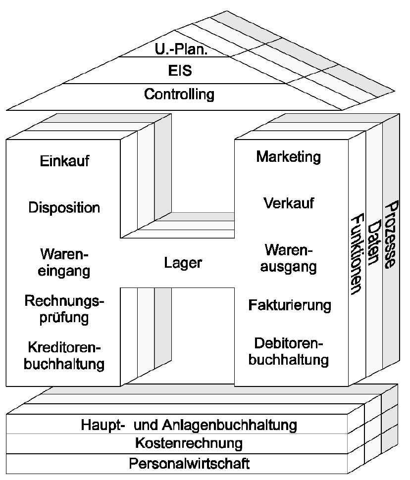

# 12.3 IT im Handel

## Handel früher vs. heute
* Produzenten- zu Konsumentenmarkt
* Angebot übersteigt Nachfrage
* Vergleichsportale (YouTube Reviews, etc.)
* Mehr Informationen
* Amazon als riesiger und dominierender Händler
* Produzent -> Großhändler -> Einzelhändler -> Konsument wurde zu Produzent -> Konsument
	* z.B.: 
		* Früher erstellte Sony Kopfhörer => zu Großhändler gesendet => zu Einzelhändler => für Bürger kaufbar
		* Heute erstellt Sony Kopfhörer und der Bürger kann sie direkt kaufen
* Versandzeiten massiv verkürzt

## Aktuelle Situation vom Handel
* Produkte Maßgeschneidert 
* Vieles passiert Online
* Massive Umstellung => Viele Geschäfte ausgestorben (z.B. viele Kleinhändler/Krämerläden)
* Marktführer
	* Amazon (Internethandel)
	* Walmart (Einzelhandel)
	* Österreich Lebensmittelhandel: 1. Spar, 2. REWE

* Im Handel sind ERP-Systeme sehr wichtig um Betriebswege, Geschäftspartner, usw zu managen
* Spar vs Rewe/Billa
	* Spar betreibt Franchising (Lokale Fillialen, die sich selbst verwalten)
	* REWE/Billa Zentralverwaltung (Alle Fillialen werden zentral verwaltet)
	
* Warenwirtschaftssysteme & Lagerverwaltung sind die wichtigsten IT-Systeme im Handel 

* Handels H

* Trends
	* Handel entwickelt sich nach Zentralverwaltung
	* Mehr Online/Bestellungen und Lieferungen
	* Regionale Werbekampagnen (Kauft lokal usw.)
	* Weniger Lokale

* Total offener Markt
	* Jeder kann (sogut wie) ohne Einschränkungen einkaufen
	* Jedes Unternehmen kann seine Produkte online anbieten

* Gastronomie
	* Moderne Bestellsysteme
	* Es werden weniger Kellner benötigt
	* Takeaway
	* Lieferservice

## Technologien für den Handel 
* Barcode
* RFID 
* Smart Shelf
* Amazon Go
* EAN

## Datengeschäft 
* Auswertungen (Im DataWareHouse werden die personenbezogenen Daten gespeichert)
* Kundenkarten um Kaufverhalten zu beeinflussen (Noch etwas mehr, um einen bestimmten Bonus zu erhalten)
* Datenerfassung 
	* Erfolgt meist über Kundenkarten
	* Welche Personengruppe kauft welche Produktearten
	* Komsumverhalten widerspiegeln
* Wie muss man was platzieren
	* Teurere Produkte meist auf Augenhöhe
	* Billigere Meist versteckter
	* Bei Kassen noch kleinere "Mitbringsel" (Kaugummis, Süßigkeiten, Rasierer, usw.)
	* Abteilungen so angeordnet, dass Kunde gerne einkaufen geht (beim Eingang angenehme Gerüche, usw.)